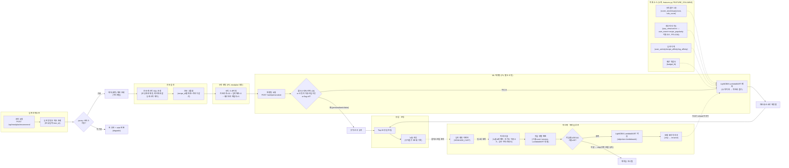

# 영수증 OCR · 레시피 랭킹 — 실제 구현 흐름도

> 코드를 직접 읽고 작성. 각 다이어그램 노드에 근거 파일:함수를 `%%` 주석으로 남겼고, 아래 표는 그 요약.
> 원본: [`recipe_OCR.mmd`](./recipe_OCR.mmd) · [`recipe_ranking.mmd`](./recipe_ranking.mmd)

---

## 1. 영수증 OCR 파이프라인

```mermaid
flowchart LR

    subgraph INPUT["입력"]
        A["영수증 이미지 업로드<br/>(촬영/캡처)"]
        B["접수 API<br/>POST /api/pantry/ocr"]
    end

    A --> B
    B --> C{"이미지 검증<br/>(빈 파일·10MB 초과)"}
    C -- "실패" --> C1["400/413 에러 응답"]
    C1 -.->|재업로드| A
    C -- "통과" --> D["비동기 job 시작<br/>(job_id 발급, PENDING)"]

    subgraph VISION["OCR 엔진 (Gemini Vision 단독)"]
        E["이미지 축소<br/>(다운스케일, 최대 1600px)"]
        F["Gemini Vision 구조화 파싱<br/>(멀티모달 → JSON 스키마)"]
    end

    D --> E --> F
    F --> G{"일시적 오류?<br/>(503/429/과부하)"}
    G -.->|재시도 최대 2회| F
    G -- "최종 실패" --> H["job FAILED<br/>(사유 기록)"]
    H -.->|다시 업로드| A

    G -- "성공" --> I["가격-품목 오정렬 보수 교정<br/>(조정/품목 정확히 1쌍일 때만 스왑)"]

    subgraph CLASSIFY["분류 캐스케이드 (라이브 호출 없이 룩업·규칙)"]
        J["분류 캐스케이드 실행<br/>(경계정책→is_food→비식품KW→gazetteer→보관법)"]
    end

    I --> J
    J --> K["job DONE 저장<br/>(인메모리 _JOBS, PG 이관 TODO)"]

    subgraph HITL["저장 · HITL 확정"]
        L["프론트 폴링<br/>GET /api/pantry/ocr/{job_id}"]
        M["HITL 편집표<br/>(needs_review 하이라이트, 수정 가능)"]
        N{"확인하고 등록"}
    end

    K --> L --> M --> N
    N -.->|다시 촬영| A
    N -- "클릭" --> O["확정 API<br/>POST /api/pantry/receipts"]

    O --> P["감사 로그 저장<br/>(ocr_receipt + ocr_receipt_item)"]
    P --> Q{"keep && storage<br/>&& 식품(비식품/조정 제외)?"}
    Q -- "아니오" --> Q1["재고 미반영"]
    Q -- "예" --> R["pantry_item 생성<br/>+ 소비기한 미입력 시 shelf_life 추정"]
    R --> S["식비 계산<br/>(담은 식품 가격 합만)"]
    S --> T["프론트가 mealplan<br/>/api/expenses 로 별도 기록"]

    subgraph REFDATA["참조 데이터 (라이브 조회 없음, 1회 로드)"]
        R1["경계정책표<br/>edge_case_food_policy.csv"]
        R2["gazetteer<br/>item_alias/item_master(DB)<br/>또는 dict_item_master.txt(파일 폴백)"]
        R3["보관법 시드<br/>kr_shelf_life_seed.csv"]
    end

    J -.->|조회| R1
    J -.->|조회| R2
    J -.->|조회| R3
```

### 노드 ↔ 실제 코드

| 노드 | 내용 | 파일 : 함수/클래스 |
|---|---|---|
| A | 영수증 이미지 업로드 | `frontend/src/components/forms/OcrFlow.tsx` : `onPick()` |
| B | 접수 API | `services/ocr/app/main.py` : `upload_receipt()`, `_accept()` |
| C | 이미지 검증(빈 파일/용량) | `services/ocr/app/main.py` : `_accept()` (HTTPException 400/413) |
| D | 비동기 job 시작 | `services/ocr/app/main.py` : `_accept()` → `asyncio.create_task(_run_job)` |
| E | 이미지 다운스케일 | `services/ocr/app/pipeline/backend/vision.py` : `_downscale()` |
| F | Gemini Vision 구조화 파싱 | `services/ocr/app/pipeline/backend/vision.py` : `VisionBackend.parse()` |
| G | 일시적 오류 재시도 | `services/ocr/app/pipeline/backend/vision.py` : `_is_transient()`, `for attempt in range(3)` |
| H | job FAILED | `services/ocr/app/main.py` : `_run_job()` except 블록 |
| I | 가격-품목 오정렬 교정 | `services/ocr/app/pipeline/process.py` : `process_image()` → `classify.py` : `realign_prices()` |
| J | 분류 캐스케이드 | `services/ocr/app/pipeline/classify.py` : `Classifier.classify()` |
| K | job DONE 저장(인메모리) | `services/ocr/app/main.py` : `_JOBS` dict (PG 이관 TODO 주석 포함) |
| L | 프론트 폴링 | `frontend/src/lib/queries.ts` : `useOcrJob()` / `services/ocr/app/main.py` : `get_result()` |
| M | HITL 편집표 | `frontend/src/components/forms/OcrFlow.tsx` : `rows`, `patch()`, `onCategory()` |
| N | 확인하고 등록 | `frontend/src/components/forms/OcrFlow.tsx` : `onConfirm()` |
| O | 확정 API | `services/pantry/app/routers.py` : `confirm_receipt()` (`POST /api/pantry/receipts`) |
| P | 감사 로그 저장 | `services/pantry/app/queries.py` : `create_ocr_receipt()`, `add_ocr_receipt_item()` |
| Q/R | pantry_item 반영 + 소비기한 추정 | `services/pantry/app/routers.py` : `confirm_receipt()` → `queries.create_item()`, `lookup_shelf_life()`, `estimate_expire_date()` |
| S | 식비 계산 | `services/pantry/app/routers.py` : `confirm_receipt()` 내 `kept_expense` |
| T | 식비 캘린더 별도 기록 | 프론트 → `mealplan` `/api/expenses` (pantry→mealplan 순환의존 회피, 코드 주석 근거) |
| R1 경계정책표 | `services/ocr/app/pipeline/classify.py` : `_load_edge()` → `pipelines/ingest/data/edge_case_food_policy.csv` |
| R2 gazetteer | `services/ocr/app/pipeline/classify.py` : `_load_gazetteer_db()`(item_alias/item_master DB 우선) / `_load_dict()`(`ml/ingredient-ner/data/dict_item_master.txt` 파일 폴백) |
| R3 보관법 시드 | `services/ocr/app/pipeline/classify.py` : `_storage_for()` → `pipelines/ingest/data/kr_shelf_life_seed.csv` |

**중요 — 재료명 정규화는 CRF NER이 아니라 gazetteer(사전) 매칭**: OCR의 품목 표준화는 `services/chat`과 동일한 exact→suffix→token→prefix 사전 매칭 로직(`_make_matcher()`)을 재사용한다. CRF 모델(sklearn-crfsuite) 자체를 호출하는 코드는 OCR 파이프라인 어디에도 없다 — 자유텍스트에서 개체명 span을 뽑는 게 아니라, Gemini Vision이 이미 품목명을 뽑아준 뒤 그 문자열을 사전과 매칭하는 구조라 CRF가 필요 없다.

---

## 2. 레시피 랭킹 파이프라인

### 노드 ↔ 실제 코드

| 노드 | 내용 | 파일 : 함수/클래스 |
|---|---|---|
| A | 추천 요청 진입 | `services/mealplan/app/routers.py` : `recommend_recipes()` |
| B | pantry 재고 조회 | `services/mealplan/app/context.py` : `HttpPantryProvider.get_pantry()` |
| C | 가용성 분기 | `services/mealplan/app/routers.py` : `ProviderUnavailable` 처리 |
| D | 제외(회피) 재료 조회 | `services/mealplan/app/context.py` : `ExclusionProvider.get_excluded_item_ids()` |
| E | 후보 레시피 SQL | `services/mealplan/app/queries.py` : `get_candidate_recipes()` (PG 직접 조회, ES 아님) |
| F | 후보 그룹화 | `services/mealplan/app/ranking.py` : `group_recipe_rows()` |
| G | 규칙 스코어링 | `services/mealplan/app/ranking.py` : `rank_recipes()`, `_score()` (가중치 `COVERAGE_W`/`EXPIRING_W`/`BUDGET_PENALTY_W`) |
| H | ML 재랭킹 호출 | `services/mealplan/app/ranking_client.py` : `personalize()` |
| I | 콜드스타트/폴백 분기 | `ml/recipe-ranking/serve.py` : `Ranker.rank()`, `MIN_EVENTS`(=20) |
| J | LightGBM 예측 | `ml/recipe-ranking/serve.py` : `Ranker._matrix()`, `model.predict()` / `ml/recipe-ranking/features.py` : `FEATURE_COLUMNS` |
| K/L | 규칙순 유지 / 재정렬 | `services/mealplan/app/ranking_client.py` : `reorder()` |
| M | Top-20 응답 조립 | `services/mealplan/app/routers.py` : `recommend_recipes()` (`ranked[:20]`) |
| N | 노출 로깅 | `services/mealplan/app/queries.py` : `insert_impressions()` → `activity.recipe_impression` |
| O | 유저 행동 이벤트 | `activity.user_event`(VIEW/ADD_CART) — `ml/recipe-ranking/features.py`의 `EXTRACT_SQL`, `serve.py`의 `pg_feature_provider()`에서 조회 |
| P | 피처 추출 | `ml/recipe-ranking/extract.py` : `extract_feature_rows()` / `features.py` : `EXTRACT_SQL` |
| Q | 학습 행렬 변환 | `ml/recipe-ranking/features.py` : `to_matrix()`, `group_sizes()` |
| R | 최소치 게이트 | `ml/recipe-ranking/retrain.py` : `MIN_ROWS`(200), `MIN_GROUPS`(20) |
| S | LightGBM 학습 | `ml/recipe-ranking/train.py` : `build_ranker()`, `_LgbRanker`(`LGBMRanker(objective="lambdarank")`) |
| T | 모델 저장 | `ml/recipe-ranking/train.py` : `save_model()` (원자적 `os.replace`) |
| T→J 리로드 | 서빙 모델 교체 트리거 | `ml/recipe-ranking/retrain.py` : `_trigger_serving_reload()` → `serve.py` : `reload_model()`(`POST /reload`) |
| X1~X4 | 피처 소스 | `ml/recipe-ranking/features.py` : `FEATURE_COLUMNS`, `raw_to_feature_rows()` |

**가드레일 관련 정정**: "알레르기" 필터는 코드에 존재하지 않는다. 실제로는 유저가 지정한 "제외(회피) 재료"(`ExclusionProvider`)가 후보 SQL 단계에서 해당 재료가 하나라도 든 레시피를 통째로 제외하는 방식으로 작동한다(`get_candidate_recipes()`의 `exclude_ids` 서브쿼리).

**후보 검색은 ES가 아니라 PG 직접 쿼리**: `ai-spec.md`에서 "레시피 인덱스" 언급이 있었지만, 실제 `/api/mealplan/recommend` 경로는 Elasticsearch가 아니라 `public.recipe_ingredient`를 보유 재료 item_id로 직접 필터링하는 PG SQL(`get_candidate_recipes()`)을 쓴다. ES 레시피 인덱스는 별도 경로(챗봇 `services/chat`의 검색 단계)에서 쓰인다 — 랭킹 경로와는 무관.

---

## 3. 코드에서 확인 못 해 추정/보완이 들어간 부분

1. **"노출 로깅 → 유저 행동 이벤트"(N ⇢ O) 연결선**: 실제 코드에 `insert_impressions()`가 곧바로 다음 이벤트를 트리거하는 함수 호출은 없다. 이 점선은 두 활동이 시간순으로 이어진다는 **데이터 흐름상의 논리적 연결**이며, 정확한 근거는 `features.py`의 `EXTRACT_SQL`이 `activity.recipe_impression`과 `activity.user_event`를 `(user_id, session_id, recipe_id)` + 30분 시간창으로 **조인**한다는 사실이다(직접 함수 호출 체인이 아니라 조인 키 관계).
2. **재학습 배치 주기 "일 1회"**: `retrain.py` 자체는 실행 방식이 `--loop <SEC>` 인자로 결정되는 범용 스크립트다. "일 1회"는 코드가 아니라 `retrain.py` 모듈 docstring의 실행 예시(`python retrain.py --loop 86400`, "compose 서비스, 일 1회")를 근거로 표기했다 — 실제 배포 시 다른 주기로 띄웠다면 다를 수 있음.
3. **OCR "신뢰도 낮을 때 자동 분기"는 존재하지 않음**: `ParsedReceipt.confidence` 필드가 정의는 되어 있지만(`base.py`, 주석: "전체 신뢰도·향후 폴백 트리거"), `VisionBackend._to_receipt()`가 이 값을 채우지 않아 **항상 None**이다 — 즉 전체-신뢰도 기반 자동 재촬영/폴백 분기는 코드상 아직 없다. 다이어그램의 "다시 촬영"/"다시 업로드" 경로는 전부 **유저가 수동으로 누르는 버튼**(HITL)이며, 자동 트리거가 아니다. 품목 단위 저신뢰 표시는 `needs_review` 플래그(분류 캐스케이드 tier 기반)로만 이루어진다.
4. **분류 캐스케이드의 "3/4단계(food_nutrition·oasis 파생)"**: `classify.py` 주석에 "TODO: DB 필요, 현재 skip"이라 명시되어 있어 다이어그램에서 제외했다(미구현 단계이므로 실제 흐름에 없음).
5. **분류 캐스케이드의 "7단계 LLM 훅"**: `classify.py` 주석에 "훅만, 아직 미배선"이라고 명시되어 있어 다이어그램에 포함하지 않았다 — 미해결 품목은 현재 `in_expense=true, needs_review=true`로만 처리되고 실시간 LLM 호출로 이어지지 않는다.
6. **"난이도"·"영양적합" 랭킹 피처는 존재하지 않음**: 초기 요청에 예시로 언급됐지만, `features.py`의 `FEATURE_COLUMNS`(11개)에 해당 피처는 없다 — 실제 피처는 규칙점수 3종·인기도 3종·유저이력 3종·예산적합 1종뿐이라 그대로만 반영했다.
