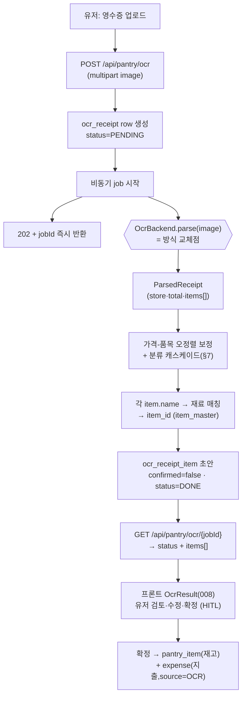

# 영수증 OCR 서비스 — 설계·구현·분류·운영 (정본)

> **작성:** 건우 (AI 담당) · 2026-07-16 · **통합 2026-07-27** (`ocr-implementation`·`ocr-method-comparison`·`ocr-nonfood-handling-proposal`·`ocr-devlog` 흡수 — 방식 선택 실측 근거는 [`ocr-model-benchmark.md`](ocr-model-benchmark.md)로 분리 유지)
> **대상 독자:** 백엔드 담당(엔드포인트·job·DB·HITL) + AI 담당(OCR 백엔드·NER·분류) + 리뷰어/포트폴리오
> **상태:** **방식 확정 = Gemini Vision 단독**(팀장 결정 2026-07-16). 골격의 교체가능 인터페이스는 유지하되 1순위 구현체는 Vision만, Tesseract/폴백은 인터페이스만 남기고 보류.
> 🔴 **클라우드(2026-07-29 결정, 전환 진행 중):** 모델은 **Gemini 유지**하되 호스팅을 **개인 Google AI API 키 → GCP Vertex AI(팀 프로젝트, 키리스 Workload Identity 연동)**으로 이전한다. 정본 = [`gcp-migration-plan.md`](gcp-migration-plan.md) · 인증/연동 = [`hybrid-cloud-federation-plan.md`](hybrid-cloud-federation-plan.md) · 전환 코드 = PR #387(`feat/ai-vertex-k8s-wiring`, main 미병합). **본 문서의 아래 "API 키/generativelanguage" 서술은 전환 완료 시 Vertex 엔드포인트로 대체**된다.
> **관련:** `ai-spec.md §7` · `design/api-spec.md #16·17·39` · `prd/schema-app-oltp.md §3.2·3.3` · `service-spec-handoff.md F5·F17` · 코드 `services/ocr/`

---

## 0. 핵심 원칙

**"이미지 → 구조화 품목" 구간만 방식(Vision/Tesseract)에 의존하고, 그 뒤(NER·분류·저장·HITL)는 방식 무관 공통 1벌."** (`ai-spec.md §7`)
→ OCR 방식을 **교체가능한 백엔드**로 캡슐화한다. 챗봇의 `EXTRACTOR_BACKEND`/`GENERATOR_BACKEND` 패턴과 동일한 결.

## 1. 담당 분리 (계약)

| 구간 | 담당 | 내용 |
|---|---|---|
| API·업로드·비동기 job | **백엔드** | `POST/GET /api/pantry/ocr`, multipart 수신, job 상태관리, `ocr_receipt(_item)` CRUD |
| **OCR 백엔드**(이미지→ParsedReceipt) | **AI(건우)** | `OcrBackend` 구현체(Vision) + 실패판정·폴백 |
| 재료 NER·분류 캐스케이드(품목명→item_id·category) | **AI(건우)** | 기존 gazetteer/NER 재사용(`ai-spec.md §1`) + §7 캐스케이드 |
| HITL 확정 → 재고·지출 반영 | **백엔드** | 확정 시 `pantry_item` + `expense` 생성 |
| 프론트 업로드/결과 화면 | 프론트 | `OcrUpload(007)` / `OcrResult(008)` |

**두 담당의 접점 = §3 인터페이스 계약뿐.** 백엔드는 `OcrBackend`를 호출만 하고 내부 방식은 몰라도 된다.

## 2. 전체 파이프라인



## 3. 인터페이스 계약 (교체점)

```python
# 방식(Vision/Tesseract)이 바뀌어도 백엔드·분류·저장은 안 건드리는 유일한 경계.
@dataclass
class ParsedItem:
    raw_text: str                 # 원문 라인 그대로  예: '삼겹살500g  8,900'
    name: str | None = None       # 백엔드가 뽑은 품목명(분류·NER 前)  예: '삼겹살'
    quantity: str | None = None   # 예: '500g'
    price: Decimal | None = None
    is_food: bool = True          # '봉투'·'할인' 등 비재료 후보 제외 플래그
    confidence: float | None = None
    # 분류 캐스케이드(§7, classify.py) 산출 — OCR 엔진 아닌 다운스트림이 채움
    item_id: int | None = None    # 백엔드 None → 공통 파이프라인이 채움
    category: str | None = None   # 식재료/가공식품/비식품, None=미해결
    storage: str | None = None    # FRIDGE/FREEZER/ROOM
    in_expense: bool = True       # 식비 포함 여부(§7.3.5)
    needs_review: bool = False    # HITL 하이라이트(§7.6)

@dataclass
class ParsedReceipt:
    items: list[ParsedItem] = field(default_factory=list)
    store: str | None = None
    purchased_at: datetime | None = None
    total_amount: Decimal | None = None
    confidence: float | None = None   # 전체 신뢰도(실패판정·폴백 트리거) ⚠️ 현재 미채움(항상 None)
    backend: str = ""                 # 처리 백엔드명(로깅)

class OcrBackend(Protocol):
    name: str
    async def parse(self, image: bytes) -> ParsedReceipt: ...
    # ⚠️ Tesseract 등 CPU-bound 구현은 내부에서 run_in_executor로 감싼다(이벤트루프 블로킹 방지).
```

**설계 포인트**
- 출력을 **구조화 품목(ParsedReceipt)**으로 통일 — Vision은 JSON을 그대로 매핑, (향후) Tesseract는 좌표 파서를 구현체 내부에 둔다. 어느 쪽이든 백엔드 밖에선 동일한 계약.
- `name`은 분류·NER **전**의 후보. `item_id`/`category`/`storage`는 공통 파이프라인(§2 C·N단계, `classify.py`)이 채운다.

### 3.1 스키마 매핑 (`prd/schema-app-oltp.md`)

| ParsedReceipt → `ocr_receipt` | ParsedItem → `ocr_receipt_item` |
|---|---|
| store · purchased_at · total_amount · (job)status | raw_text · name · (NER)item_id · quantity · price · is_food · category · (기본 false)confirmed |

## 4. 방식 오케스트레이션 (Vision 단독 확정 · 폴백은 향후 확장)

방식 조합도 **백엔드 조합**으로 캡슐화 — `FallbackOcrBackend([Vision, Tesseract])`. 환경변수 `OCR_BACKEND`로 선택(`vision`(현행)·`mock`(dev/CI)·향후 `vision_first`/`tesseract`).

```
FallbackOcrBackend.parse(image):
  1. VisionBackend.parse(image) 시도 (1순위 — 감열지 정확도·구조 JSON)
  2. 성공 판정 통과 → 반환
  3. 실패 판정 → TesseractBackend 폴백 (무료·오프라인 안전망)
  4. 폴백도 실패 → ParsedReceipt(items=[], confidence=0) → status=FAILED → 수동입력 유도
```

**실패 판정 기준** (`ai-spec.md §7` — 하나라도 걸리면 실패): ①파싱 품목 0건 ②품목 금액 합 ≠ 영수증 합계 ③NER 매칭률 임계 미달 ④OCR confidence 저하. ⚠️ 현재 `confidence`는 백엔드가 미채움 → ④ 자동 트리거는 미배선(§10). 저신뢰 표시는 품목 단위 `needs_review`로만.

## 5. API 계약 (`design/api-spec.md`)

| # | Method | Path | 동작 | 응답 |
|---|---|---|---|---|
| 16 | POST | `/api/pantry/ocr` | 영수증 이미지 업로드(비동기 접수) | `202` · `{jobId}` |
| 17 | GET | `/api/pantry/ocr/{jobId}` | 처리 상태·결과 조회 | `200` · `{status, items[]}` |
| 39 | POST | `/api/expenses` | 지출 기록(OCR 연동, `source=OCR`, `receipt_id`) | `201` |

- 비동기 이유: Vision API 왕복 수초 → 202+폴링. 프론트 `OcrResult(008)`가 status 폴링.
- **원본 이미지는 미저장**(분석용만). 보관정책 바뀌면 컬럼 추가.

## 6. HITL 확정 (백엔드)

`ocr_receipt_item.confirmed=false`가 초안. 유저가 `OcrResult(008)`에서 품목명·수량·가격·is_food·category 수정 후 확정:
- 확정 식재료(keep·storage 지정) → `pantry_item`(source=OCR) 생성 + 소비기한 미입력 시 `shelf_life_ref` 추정.
- 식비 = **담은 식품 가격 합**(§7.3.5) → `expense`(source=OCR, receipt_id) → 식비 캘린더(F17).
- OCR 오류·영수증 약어('삼겹500')의 모호성은 사람이 최종 보정(자동수렴 불가 전제, `design.md`).

## 7. 분류·라우팅 (확정 — 구 `ocr-nonfood-handling-proposal §7`)

> **배경**: 실물 마트 영수증엔 "깨끗한 요리 재료"만 있지 않다 — 가공식품·즉석식·간식·음료가 다수(§부록 9.3). `is_food`(식품 vs 봉투)만으론 **가운데(식품이지만 비재료)**를 재료와 똑같이 취급해 전부 미매칭 → "실패"처럼 보이는 설계 사각지대. 아래는 그 위에서 팀 논의로 **확정된 설계**이자 현재 구현(`classify.py`)의 SoT.

### 7.0 대원칙
1. **OCR 엔진 동결** — 분류를 OCR 프롬프트에 넣지 않는다(엔진에 추론 부담 X). OCR은 텍스트만.
2. **분류·라우팅 = 다운스트림 별도 단계**(라이브 호출 없이 룩업·규칙).
3. **신규 대용량 데이터 저술 0** — 레포 기존 자산만 재사용(`is_food`·`food_nutrition`·레시피재료·`oasis`·`kr_shelf_life`·`dict_item_master`).
4. **생성형 AI는 미해결 품목만** — 캐스케이드에서 싼 방법이 다 실패한 품목만 LLM, 결과는 DB화(품목당 생애 1회). *(현재 7단계 LLM 훅은 미배선 — §10)*

### 7.1 앱엔 축이 2개
| 축 | 대상 | 비재료(도넛·음료·즉석식) |
|---|---|---|
| **식비(expense)** | 모든 식품 구매 | ✅ 전부 포함(먹는 데 쓴 돈) |
| **재고/레시피(pantry)** | 재료만 | ❌ (레시피 못 돌림) |
→ 비재료는 노이즈가 아니라 식비축에 속하는 정상 데이터. **거부가 아니라 "올바른 축으로 라우팅".**

### 7.2 분류 캐스케이드 (싼 것부터, 맞으면 멈춤 — `classify.py: Classifier.classify()`)
| 단계 | 판정 | 소스 |
|---|---|---|
| 0. 경계정책(7.7) | 생수·얼음·홍삼정 등 정책 확정어 | 코드 상수 `_EDGE_POLICY` |
| 1. `is_food=false` | 비식품(봉투·할인·포인트) | OCR 출력 |
| 2. gazetteer 매칭(exact→suffix→token→prefix) | 식재료 + `item_id` | `item_alias`/`item_master`(DB) or `dict_item_master.txt`(파일 폴백) |
| 3/4. `food_nutrition`·`oasis` 파생 → 가공식품 | category | ⏳ TODO(DB 필요, 현재 skip) |
| 5. `shelf_life_ref`(source=CURATED) / 규칙셋 | 보관법 | DB(#243) → 키워드 폴백 |
| 6. 문자 n-gram 유사도 상속(기존 1,054 사전, 최근접 품목 속성) | 최근접 속성 | ⏳ 제안(현 matcher는 exact→prefix까지, n-gram 미구현) |
| 7. 미해결 → LLM(실시간·동기) | category | ⏳ 훅만, 미배선 |

### 7.3 품목 라우팅 (5갈래)
1. **식재료**: `item_id` 매핑(없으면 후보 제안→검토큐 7.10). pantry 추가 + 식품.
2. **가공식품**: 식품. pantry는 조리재료성만 후보(식용유·간장), 간식·음료는 식비만.
3. **비식품 '상품'**(세제·봉투·화장지): 식비에서 차감, pantry X.
4. **조정**(할인·쿠폰·포인트·음수): 품목 아님 → pantry X, 식비 차감 대상 아님(총액에 이미 반영).
5. **미지**: 식품 취급 + "확인" 플래그(마트=음식 확률↑).

#### 7.3.5 식비 계산 — 담은 식품 가격 합
> **식비 = 유저가 냉장고에 담은(keep) 식품의 가격 합.** (구현 `pantry/routers.py: confirm_receipt`의 `kept_expense`.)
- 총액 앵커가 아니라 **선택분만** — 선택 안 한 줄·비식품·조정 제외.
- **조정은 차감 안 함**(할인·쿠폰은 total에 이미 반영, 이중차감 금지).
- **가격-품목 오정렬 보정**(`realign_prices`): 조정-양수 1개 ∧ 비조정-음수 1개가 정확히 한 쌍일 때만 스왑(합 보존). 애매하면 손대지 않고 `needs_review`.
- **부호-종류 불일치 → HITL 플래그**: 식품인데 음수 / 할인인데 양수 = 오정렬 의심.

### 7.4 보관법
- 기본값 = **냉장(FRIDGE)** — 상하는 걸 실온 방치가 최악이라 안전측. 냉동*·아이스→냉동, 우유·두부→냉장, 라면·통조림→실온.
- ⚠️ **보관법은 학습·개인화·전역변경 안 함** — 삼겹살은 같은 사람도 냉장/냉동이 갈림. 인스턴스별 사용자 선택만, "기본"으로 저장 안 함. (DB화 대상은 category뿐.)

### 7.5 정규화·매칭·조인 (기존 자산 재사용)
품목명 구조 = 브랜드+수식어+핵심명+용량("돈생삼겹살500g"). 제안 파이프라인:
```
OCR명 → ① 정규화(기존 index PR#69/74 재사용: 브랜드·용량·단위 제거)
      → ② NER로 핵심 재료명 추출("돈생삼겹살"→"삼겹살")
      → ③ 정규화 표준명 정확매칭 → ④ 실패 시 문자 n-gram 유사도 → ⑤ 미해결→LLM
```
- **조인 키 = 정규화 표준명(canonical name)** — 모든 소스(item_master·nutrition·레시피·oasis)를 같은 정규화로 맞춰 조인(외부 ID 의존 X). oasis 카테고리→3분류는 작은 매핑표(코드).
- ⚠️ **현 구현(`classify.py`)의 matcher는 exact→suffix→token→prefix까지** — ④ n-gram 유사도·⑤ LLM은 제안 단계(§7.2의 6·7단계와 동일, 미구현).

### 7.6 사용자 상호작용 (자동화 우선)
- **자동 배치 + 사후 수정** — 질문 팝업이 아니라 최선 추측값 배치 후 틀린 것만 수정.
- 확정 화면: 고신뢰=값 채워진 채, 저신뢰=노란 하이라이트+"자동 추정" 배지+프리필(그 줄만 수정).
- OCR 깨짐: 줄 손상=그 줄만 플래그, 전체 손상(파싱률·합계정합 임계 초과)="재촬영" → 2회차도 실패 시 수동입력 유도.

### 7.7 경계정책표
- 정책=로직이라 **코드 상수 `_EDGE_POLICY`로 관리**(구 CSV 파일 로드는 배포 이미지에 파일 부재로 상시 skip되던 드리프트 → #243로 DB/코드화). 컬럼 `term, category, in_expense`. 단어 추가는 PR(거버넌스).
- 확정: `생수→가공식품·식비포함`, `얼음→가공식품·식비포함`, `홍삼정(건기식)→비식품·식비제외`.

### 7.8 비용
- OCR: 장당 **~0.45원**(flash-lite). 분류 캐스케이드 0~6단계 **0원**, 7단계 LLM만 과금(품목당 <0.05원·생애 1회 DB화) — 비용은 "등장한 고유 품목 수"에만 비례, 정상상태 0 수렴.
- **월 상한 캡 없음** — LLM 장애 시 기본값(식비포함+냉장+확인) 폴백으로 흐름 유지(차단 아님).

### 7.9 이미지 썸네일 (별개 트랙 · 보류)
- 실사진 아닌 **작고 단순한 그림**(생성형 고려 중). **오프라인 1회·품목당 생애 1회.** 저품질 티어 ~15~60원/장, 로컬 SD면 ~0원.
- 카탈로그 캐시 + category 아이콘 폴백(실시간 생성·웹검색 안 함). → 분류 전략과 분리, 별도 확정 필요(§10).

### 7.10 ⚠️ item_master 자동 추가 거버넌스
새 식재료를 공용 카탈로그에 무분별 insert하면 데이터 품질 붕괴(중복·비표준명·OCR 오탐). → **바로 추가 금지.** "새 식재료 후보" 제안 → 검토큐(표준명·중복 검사) → 승인 후 추가. **Taylor(데이터 오너) 소관.**

### 7.11 담당 경계
| 항목 | 담당 |
|---|---|
| 분류 캐스케이드·정규화·NER·미해결 LLM·category 산출 | **AI(건우)** |
| `item_master`(category)·pantry 저장·식비 계산·검토큐·경계정책 거버넌스 | 백엔드/데이터(Taylor) |
| HITL 선택지·확정 UX·아이콘 세트 | 제품/프론트 |

## 8. 구현 (내부 동작·기술 선택 — 구 `ocr-implementation.md`)

### 8.1 요청 → 응답 종단 (`services/ocr/`)
```
POST /api/pantry/ocr → main._accept: 크기검증 → job_id → job=PENDING → 백그라운드 태스크 → 202
  └ process.process_image(image, backend)
      ├ backend.parse(image)  # VisionBackend: _mime 판별 → Gemini 멀티모달 → _to_receipt(안전파싱)
      │     └ _dec('12,400'→Decimal) · _dt(문자열→datetime) · _to_bool(문자열 'false' 방어)
      ├ realign_prices()      # 가격-품목 오정렬 보정(§7.3.5)
      └ classify.classify()   # 분류 캐스케이드(§7): category·storage·in_expense·item_id
GET /api/pantry/ocr/{job_id} → OcrStatusResponse{status, store, total, items[]}
```

### 8.2 핵심 기술 선택
| 기술 | 왜 |
|---|---|
| **Gemini Vision(멀티모달)** | OCR = 탐지+인식+**레이아웃 파싱**(품목↔가격 2D)을 한 호출로 + 구조화 JSON 직출력 → 좌표 파서(Tesseract 시 1.5~2주) 불필요. 감열지·한국어 정확도 최상(벤치마크) |
| `response_mime_type=json` + 프롬프트 스키마 + `temperature=0` | 자유텍스트 정규식 파싱 대신 모델이 JSON 강제 → `json.loads` 1회, 결정성↑ |
| `thinking_budget` 최소 | OCR은 인식·추출(추론 불필요) → thinking 사실상 OFF로 비용 63%↓·지연 16배↓(벤치마크) |
| 교체가능 `OcrBackend` 프로토콜 | 방식 바뀌어도 process·분류·HTTP 불변. Tesseract/폴백 자리를 무비용으로 열어둠 |
| FastAPI + async job(202+폴링) | Vision 네트워크 왕복 수초 → 동기면 타임아웃. 챗봇과 동형이라 백엔드가 프록시로 붙임 |
| `Decimal`(금액)·`datetime`(시각) | 돈은 float 오차 금물. '12,400' → `_dec`가 콤마 제거 후 Decimal |
| gazetteer(DB 우선/파일 폴백) | 품목 표준화는 CRF가 아니라 사전 매칭 재사용(chat과 동일 로직). Vision이 뽑은 품목명을 사전 매칭 |
| 챗봇과 **별도 Gemini 키** | OCR(비전·장당 과금)·챗봇(refine) 비용을 서비스 단위로 구분·추적. 서비스별 `.env` |

**프롬프트 anti-hallucination 원칙**(`vision.py _SYSTEM`): 매장·일시·합계·품목만 JSON 출력, **근거 없으면 null·금액/품목 날조 금지**, 판독 불가 시 raw_text만 채우고 나머지 null → 환각 억제 + 후처리 최소.

### 8.3 견고성 (graceful degradation)
- 안전 타입 변환(`_dec`/`_dt`/`_mime`/`_to_bool`)이 모델 이상값을 None으로 흡수(크래시 방지).
- JSON 파싱 실패→빈 dict, job 예외→`status=FAILED, reason`(서비스 유지), 빈/과대 이미지→400/413.
- 503/429/overloaded **자동 재시도** 최대 2회(백오프), 타임아웃은 재시도 안 함. 타임아웃 60s, 다운스케일 1600px.
- 판독 불가 라인도 raw_text로 남겨 HITL 보정.

## 9. k8s HA — 잡 상태 동기화 (replica 확장)

k8s에서 OCR 파드를 `replicas ≥ 2`로 늘리면 인메모리 `_JOBS`가 파드 로컬이라 **폴링 조회가 유실**(파드A 생성·파드B 폴링→404).

### 9.1 두 계층 분리
| 계층 | 무엇 | 저장소 | 소관 |
|---|---|---|---|
| **결과 영속** | 추출 결과(`ocr_receipt(_item)`) | **PG(불변)** | 백엔드 |
| **진행상태 동기화** | 잡 status(PENDING/RUNNING/DONE/FAILED) | **Redis(결정)** | AI 서비스 |

### 9.2 결정 — 진행상태는 Redis (#296)
status는 수초짜리 전이값 → TTL 자동소멸에 부합 · 초단위 폴링 read/write를 DB에서 격리(읽기폭주 회피) · 챗 세션이 동일 패턴 검증 · Redis(Sentinel) 이미 스택 존재. **동작**: `POST` 시 `SETEX ocr:job:{id}` PENDING → 완료 시 갱신 → `GET`은 Redis 조회(어느 파드든) → 최종 결과만 PG.
- **이관 규칙**: 상태 외부화 전까지 `replicas: 1` 고정, Redis 외부화 완료 후 replica 확장 + HPA.

## 10. 미결 / 다음 반복

| 항목 | 상태 |
|---|---|
| OCR 방식 (Vision 단독) | ✅ 확정(팀장 2026-07-16) |
| 분류 캐스케이드·라우팅(§7) | ✅ 구현(`classify.py`) |
| shelf_life·경계정책 DB화 | ✅ #243 해소 |
| 잡 상태 Redis 동기화 | ✅ 결정(#296), 배선 대기 |
| Vision 유료예외 AGENTS.md 재승인 문서화 | ⏳ |
| `confidence` 채움 + 실패판정 ④ 자동 폴백 | ⏳ 미배선 |
| classify 3/4단계(가공식품 DB 파생)·7단계 LLM 훅 | ⏳ 미배선 |
| measure 필드(중량 판매 g/kg 분리, 부록 9.2) | ⏳ |
| 실물 감열지 정확도 PoC | ⏳ (합성은 파이프라인 검증까지) |

**남은 결정 필요 항목** (구 nonfood §7.12·§4 — 팀 결정 대기):
- **손상도 임계값** — 전체 재촬영 트리거 기준(파싱률·합계정합 컷).
- **식품 카테고리 taxonomy** — 몇 단계 분류(신선/가공/즉석·간편/간식·음료/기타 안).
- **경계정책 초기목록 확장** — 사료·종이컵·주류·담배 등 식비 취급(추후 PR).
- **per-instance 보관 수정 UX** — 사용자가 냉장/냉동 옮기는 화면(제품).
- **이미지 썸네일**(§7.9) — 생성형 여부·모델·품목 범위·로컬 vs API.
- **measure 필드**(중량 판매 g/kg 분리, 부록 9.2) — `992g` 같은 중량판매를 count와 분리.

---

## 부록 A. 개발 이력 요약 (구 `ocr-devlog.md` — 실패 포함)

| # | 단계 | 결과 | 핵심 |
|---|---|---|---|
| 1 | 구상·설계 | — | 방식 3안 비교 → Vision 단독, 교체가능 백엔드 |
| 3 | 동작검증(목) | ✅+🐛 | HTTP 종단 통과 · `is_food="false"`(문자열) bool 오판 → `_to_bool` 방어 픽스 |
| 4 | 실측 1차 | ❌ | "분석 실패: 알 수 없음" = **20s 타임아웃**(빈 reason 버그로 가려짐) |
| 5 | 개선 1차 | — | 타임아웃 60s · 빈-reason 픽스(+traceback 로깅) · 다운스케일 |
| 6-7 | 실측 2차·개선 | ❌→ | 합성 PIL 폰트 한글 글리프 없음(이미지 결함) → Noto Sans KR · **503/429 자동 재시도** |
| 8 | 실측 3차 | ✅ | 합성 종단 성공(매장·합계·품목·is_food 정확) |
| 9.1 | 실물 1차 | ❌→✅ | Gemini가 `quantity`를 int로 반환 → Pydantic ValidationError → `_str_or_none` 강제. **교훈: 합성 성공만 보고 PR한 건 성급(PR #87 회수)** |
| 9.3 | 실물 발견 | 과제 | 비재료 식품 다수 → §7 2축 라우팅으로 재프레이밍 |
| 11 | thinking 오버헤드 | ❌→✅ | 기본 thoughts 828토큰이 지연 24~41s·4.55원/장의 주범 → thinking OFF로 2.5s·1.70원(정확도 동일) |

**관통하는 교훈**: 합성 성공 ≠ 실물 성공(실물이 int-quantity·비재료·감열지 문제를 잡음) · 실패는 reason·로그로 드러나야 진단 가능 · 단발 API 오류(503)로 통째 실패 금지(재시도).
