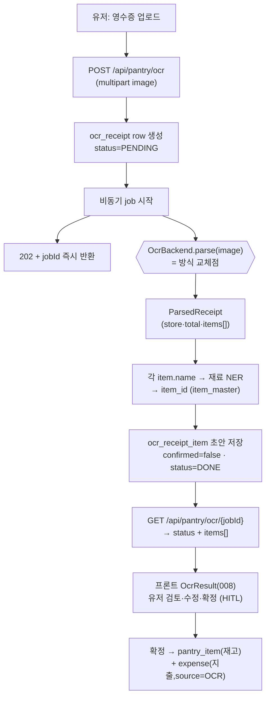

# 영수증 OCR 서비스 골격 설계 (방식무관 · 백엔드 핸드오프)

> **작성:** 건우 (AI 담당) · 2026-07-16
> **대상 독자:** 백엔드 담당(엔드포인트·job·DB·HITL) + AI 담당(OCR 백엔드·NER)
> **상태:** 골격 설계 초안. **방식 확정 = Gemini Vision 단독**(팀장 결정 2026-07-16, [`ocr-method-comparison.md`](ocr-method-comparison.md)). 골격의 교체가능 인터페이스는 유지하되 **1순위 구현체는 Vision만**, Tesseract/폴백은 보류.
> **관련:** `ai-spec.md §7`(방식) · `design/api-spec.md #16·17·39`(API) · `prd/schema-app-oltp.md §3.2·3.3`(테이블) · `service-spec-handoff.md F5·F17`(플로우)

---

## 0. 핵심 원칙

**"이미지 → 구조화 품목" 구간만 방식(Vision/Tesseract)에 의존하고, 그 뒤(NER·저장·HITL)는 방식 무관 공통 1벌."** (`ai-spec.md §7`)
→ OCR 방식을 **교체가능한 백엔드**로 캡슐화한다. 챗봇의 `EXTRACTOR_BACKEND`/`GENERATOR_BACKEND` 패턴과 동일한 결.

## 1. 담당 분리 (계약)

| 구간 | 담당 | 내용 |
|---|---|---|
| API·업로드·비동기 job | **백엔드** | `POST/GET /api/pantry/ocr`, multipart 수신, job 상태관리, `ocr_receipt(_item)` CRUD |
| **OCR 백엔드**(이미지→ParsedReceipt) | **AI(건우)** | `OcrBackend` 구현체(Vision/Tesseract) + 실패판정·폴백 |
| 재료 NER(품목명→item_id) | **AI(건우)** | 기존 NER 엔진 재사용(`ai-spec.md §1`) |
| HITL 확정 → 재고·지출 반영 | **백엔드** | 확정 시 `pantry_item` + `expense` 생성 |
| 프론트 업로드/결과 화면 | 프론트 | `OcrUpload(007)` / `OcrResult(008)` (이미 존재) |

**두 담당의 접점 = 아래 §3 인터페이스 계약뿐.** 백엔드는 `OcrBackend`를 호출만 하고 내부 방식은 몰라도 된다.

## 2. 전체 파이프라인



## 3. 인터페이스 계약 (교체점)

```python
# 방식(Vision/Tesseract)이 바뀌어도 백엔드·NER·저장은 안 건드리는 유일한 경계.
from typing import Protocol
from dataclasses import dataclass, field
from datetime import datetime
from decimal import Decimal

@dataclass
class ParsedItem:
    raw_text: str                 # 원문 라인 그대로  예: '삼겹살500g  8,900'
    name: str | None = None       # 백엔드가 뽑은 품목명(NER 前)  예: '삼겹살'
    quantity: str | None = None   # 예: '500g'
    price: Decimal | None = None
    is_food: bool = True          # '봉투'·'할인' 등 비재료 후보 제외 플래그
    confidence: float | None = None

@dataclass
class ParsedReceipt:
    items: list[ParsedItem] = field(default_factory=list)
    store: str | None = None
    purchased_at: datetime | None = None
    total_amount: Decimal | None = None
    confidence: float | None = None   # 전체 신뢰도(실패판정·폴백 트리거)
    backend: str = ""                 # 처리 백엔드명(로깅·디버깅)

class OcrBackend(Protocol):
    name: str
    async def parse(self, image: bytes) -> ParsedReceipt: ...
    # ⚠️ Tesseract 등 CPU-bound 구현은 내부에서 run_in_executor로 감싼다(이벤트루프 블로킹 방지).
```

**설계 포인트**
- 출력을 **구조화 품목(ParsedReceipt)**으로 통일 — Vision은 JSON을 그대로 매핑, Tesseract는 **좌표 파서를 구현체 내부에** 두어 라인→품목으로 변환. 어느 쪽이든 백엔드 밖에선 동일한 계약.
- `name`은 NER **전**의 후보. `item_id` 매칭은 공통 파이프라인(§2 N단계)이 담당 — 백엔드는 품목코드를 몰라도 된다.
- `confidence`/`total_amount`는 **실패판정**용(§4).

### 3.1 스키마 매핑 (`prd/schema-app-oltp.md`)

| ParsedReceipt | → `ocr_receipt` | ParsedItem | → `ocr_receipt_item` |
|---|---|---|---|
| store | store | raw_text | raw_text |
| purchased_at | purchased_at | name | name |
| total_amount | total_amount | (NER 결과) | item_id |
| (job 상태) | status | quantity | quantity |
| | | price | price |
| | | is_food | is_food |
| | | (기본 false) | confirmed |

## 4. Vision-first + Tesseract 동작순서

방식 오케스트레이션도 **백엔드 조합**으로 캡슐화한다 — `FallbackOcrBackend([Vision, Tesseract])`.
환경변수 `OCR_BACKEND=vision_first`로 선택(단일 `vision`/`tesseract`도 가능).

```
FallbackOcrBackend.parse(image):
  1. VisionBackend.parse(image) 시도 (1순위 — 감열지 정확도·구조 JSON)
  2. 성공 판정 통과 → 그대로 반환
  3. 실패 판정 → TesseractBackend.parse(image) 폴백 (무료·오프라인 안전망)
  4. 폴백도 실패 → ParsedReceipt(items=[], confidence=0) 반환
       → 공통 파이프라인이 ocr_receipt.status=FAILED 로 마감 → 프론트가 수동입력 유도
```

**Vision을 1순위로 두는 이유**: 감열지 정확도가 실사용을 좌우하고, HITL 보정 부담을 줄인다. Tesseract 폴백은 **① Vision API 장애/타임아웃 시 서비스 연속성 ② 오프라인/비용회피 모드**의 안전망.

**실패 판정 기준** (`ai-spec.md §7` — 어느 단계에서든 하나라도 걸리면 실패):
1. 파싱 품목 **0건**
2. 품목 금액 합 **≠ 영수증 합계**(total_amount 대조)
3. **NER 품목 매칭률** 임계 미달
4. OCR **confidence** 저하

> 대안 orderings: 비용 최소가 목표면 `tesseract_first`(쉬운 건 무료, 어려운 것만 Vision — `ai-spec §7`의 ②안)도 같은 `FallbackOcrBackend`로 구성 가능. **골격이 방식·순서 무관**이라 PoC 후 조합만 바꾸면 된다.

## 5. API 계약 (`design/api-spec.md`)

| # | Method | Path | 동작 | 응답 |
|---|---|---|---|---|
| 16 | POST | `/api/pantry/ocr` | 영수증 이미지 업로드(비동기 접수) | `202` · `{jobId}` |
| 17 | GET | `/api/pantry/ocr/{jobId}` | 처리 상태·결과 조회 | `200` · `{status, items[]}` |
| 39 | POST | `/api/expenses` | 지출 기록(OCR 연동, `source=OCR`, `receipt_id`) | `201` |

- 비동기 이유: OCR(특히 Vision API 왕복)은 수초 소요 → 202+폴링. 프론트 `OcrResult(008)`가 status 폴링.
- **원본 이미지는 미저장**(스키마 주석: 분석용만). 보관정책 바뀌면 컬럼 추가.

## 6. HITL 확정 (백엔드)

`ocr_receipt_item.confirmed=false`가 초안. 유저가 `OcrResult(008)`에서 품목명·수량·가격·is_food 수정 후 확정:
- 확정 품목 → `pantry_item`(재고, source=OCR) 생성
- 지출 → `expense`(source=OCR, category=GROCERY, receipt_id=…) 생성 → 식비 캘린더(F17)
- OCR 오류 + 영수증 약어('삼겹500')의 모호성을 사람이 최종 보정 (`design.md §자동수렴 불가` 전제).

## 7. 미결 사항 (PoC/결정 대기)

1. ✅ **OCR 방식** — **Gemini Vision 단독 확정**(팀장, 2026-07-16). 초기 구현은 `VisionBackend`만. Tesseract/`FallbackOcrBackend`는 인터페이스만 남기고 **보류**(§4는 향후 확장 참고용). PoC는 정확도·프롬프트 튜닝용.
2. **Vision 유료예외 승인** — 팀장 구두 승인 → `AGENTS.md` 재승인 **문서화 필요**. **키는 챗봇과 분리**(비용 서비스별 구분·추적 목적, 신규 발급 → `services/ocr/.env`).
3. **job 실행 방식** — 백그라운드 태스크 vs 큐(design.md: "OCR은 동기 호출" 언급 있으나, Vision 지연 고려 시 async job 권장 — 백엔드와 협의).
4. **ocr_receipt_item vs result jsonb** — 정규화 테이블 확정(`schema §255 결정필요 #3`).
5. **NER 매칭 실패 품목** 처리(item_id=null 허용, HITL에서 수동 지정).

## 8. 구현 착수 순서(제안)

1. `OcrBackend` 계약 + `ParsedReceipt/Item` 데이터클래스 (AI) — 이 문서 §3.
2. `TesseractBackend`(무료·오프라인 기준선) 또는 `VisionBackend`(PoC용) 1개 구현 (AI).
3. `FallbackOcrBackend` + `OCR_BACKEND` 선택 팩토리 (AI).
4. 공통 파이프라인: parse → NER → `ocr_receipt_item` 초안 (AI+백엔드 접점).
5. 엔드포인트·job·HITL 확정 플로우 (백엔드).
