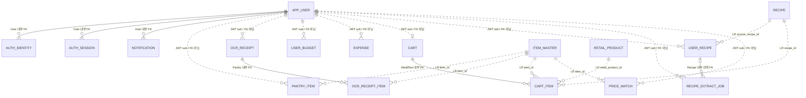

# 통합 MSA 데이터 정의서 — 서비스별 OLTP + 공통 Data Tier

> 상태: 통합 제안 초안  
> 작성일: 2026-07-15  
> DB 기준: PostgreSQL  
> 적용 단계: Docker Compose 기반 MVP → 향후 서비스별 DB 분리 가능 구조  
> 상위 정본: `docs/design.md` — 충돌 시 `design.md`가 우선한다.

## 1. 목적

이 문서는 다음 세 설계를 하나의 구현 기준으로 합친다.

1. `docs/design/04_user_data_specification.txt`의 인증·프로필·사용자 기능 상세
2. `docs/prd/data-model-app-oltp.md`의 OCR·장바구니·추출작업 정규화 구조
3. MSA 원칙인 서비스별 데이터 소유권, 서비스 간 FK 금지, JWT 사용자 문맥, Kafka/API 연동

핵심 결론은 다음과 같다.

- 같은 서비스가 소유한 테이블 사이에서만 물리 FK를 사용한다.
- 다른 서비스의 테이블에는 물리 FK를 만들지 않는다.
- 비-User 서비스의 `user_id`는 JWT `sub`에서 받은 사용자 식별자이며 `app_user` FK가 아니다.
- 크롤링·공공 데이터는 당분간 공통 `data_tier` 스키마에 두고 서비스가 읽기 전용으로 사용한다.
- 서비스 OLTP에서 Data Tier로 향하는 참조는 물리 FK가 아닌 논리참조(LR)로 유지한다.
- 서비스 간 상태 변화는 API 또는 Kafka 이벤트로 전달한다.

## 2. Docker 단계 배치 원칙

현재는 PostgreSQL 인스턴스 하나를 사용하되 서비스별 스키마와 권한을 분리한다.

```text
PostgreSQL
├── user_oltp       # User Service만 쓰기
├── pantry_oltp     # Pantry Service만 쓰기
├── mealplan_oltp   # MealPlan Service만 쓰기
├── recipe_oltp     # Recipe Service만 쓰기
├── price_oltp      # Price Service만 쓰기
└── data_tier       # 크롤링·공공 데이터, 서비스 읽기 전용
```

권한 규칙:

- 각 서비스 DB 계정은 자기 OLTP 스키마에만 쓰기 권한을 가진다.
- 다른 서비스 OLTP 스키마를 직접 조회하거나 조인하지 않는다.
- 필요한 서비스에는 `data_tier`의 `SELECT`만 허용한다.
- 스키마가 같은 PostgreSQL에 있더라도 서비스 경계를 넘는 FK를 만들지 않는다.
- Gateway와 ML Serving은 MVP에서 자체 OLTP 스키마를 갖지 않는다.

이 배치는 나중에 스키마를 별도 PostgreSQL DB로 옮겨도 서비스 테이블과 제약을 크게 바꾸지 않도록 하기 위한 것이다.

## 3. 참조 유형

| 표기 | 의미 | DB 제약 | 사용 범위 |
|---|---|---:|---|
| PK | 기본키 | 적용 | 테이블 내부 |
| FK | 물리 외래키 | 적용 | 같은 서비스 또는 같은 Data Tier 내부 |
| UK | 유일키 | 적용 | 같은 테이블/서비스 내부 |
| USER_REF | JWT 사용자 논리참조 | 미적용 | 비-User 서비스의 `user_id` |
| LR | Data Tier 논리참조 | 미적용 | 일반 컬럼의 공통 데이터 ID |
| JSON_LR | JSONB 내부 논리참조 | 미적용 | 배열·객체 내부 공통 데이터 ID |
| EVENT_REF | 이벤트 상관관계 ID | 미적용 | 다른 서비스에서 생성한 레코드 ID |

## 4. 서비스별 데이터 소유권

| 서비스 | 소유 테이블 | 비고 |
|---|---|---|
| Gateway | 없음 | JWT 검증·라우팅, 업무 데이터 미저장 |
| User | `app_user`, `auth_identity`, `auth_session`, `notification` | Auth와 알림은 User Service 내부 모듈 |
| Pantry | `pantry_item`, `ocr_receipt`, `ocr_receipt_item` | 재고·소비기한·OCR 처리 |
| MealPlan | `user_budget`, `expense`, `cart`, `cart_item` | 예산·지출의 집계 일관성을 위해 예산을 MealPlan이 소유 |
| Recipe | `user_recipe`, `recipe_extract_job` | 개인 레시피와 YouTube 추출 작업 |
| Price | `price_watch` | 사용자 목표가격 감시 |
| ML Serving | 없음 | 호출 서비스가 입력 전달, 사용자 DB 직접 조회 금지 |
| Data Tier | 크롤링·공공 데이터 테이블 | 특정 사용자가 소유하지 않는 읽기 데이터 |

알림 설정은 MVP에서 별도 테이블로 분리하지 않고 `app_user.notification_settings` JSONB로 관리한다. 알림 설정을 조건 검색하거나 채널별 이력이 필요해질 때 `notification_setting` 테이블로 승격한다.

## 5. 전체 관계 개요



점선은 업무상 관계를 설명할 뿐 물리 FK가 아니다.

## 6. User Service 데이터 정의

### 6.1 `app_user` — 사용자·프로필·설정

| 컬럼 | 의미 | 타입 | NULL | 키/제약 |
|---|---|---|---:|---|
| `id` | 사용자 ID, JWT `sub` 원본 | `bigserial` | N | PK |
| `nickname` | 닉네임 | `text` | N | |
| `status` | 계정 상태 | `text` | N | CHECK |
| `notification_settings` | 알림 설정 | `jsonb` | N | DEFAULT `{}` |
| `allergy_item_ids` | 알레르기 표준품목 ID 배열 | `jsonb` | N | DEFAULT `[]`, JSON_LR |
| `excluded_item_ids` | 제외 표준품목 ID 배열 | `jsonb` | N | DEFAULT `[]`, JSON_LR |
| `diet_preferences` | 식단 선호 설정 | `jsonb` | N | DEFAULT `{}` |
| `created_at` | 가입일시 | `timestamptz` | N | DEFAULT `now()` |
| `updated_at` | 수정일시 | `timestamptz` | N | DEFAULT `now()` |
| `withdrawn_at` | 탈퇴일시 | `timestamptz` | Y | |

규칙:

- `status IN ('ACTIVE','SUSPENDED','WITHDRAWN')`
- `notification_settings`, `diet_preferences`는 JSON object여야 한다.
- `allergy_item_ids`, `excluded_item_ids`는 bigint 배열이어야 한다.
- 배열 내부 ID는 `data_tier.item_master.item_id` 존재 여부를 애플리케이션에서 검증한다.

### 6.2 `auth_identity` — 인증 수단

| 컬럼 | 의미 | 타입 | NULL | 키/제약 |
|---|---|---|---:|---|
| `id` | 인증수단 ID | `bigserial` | N | PK |
| `user_id` | 사용자 ID | `bigint` | N | FK → `app_user.id`, CASCADE |
| `provider` | 인증 제공자 | `text` | N | CHECK |
| `provider_subject` | 제공자 고정 사용자키 | `text` | N | |
| `login_email` | LOCAL 로그인 이메일 | `text` | Y | |
| `password_hash` | 비밀번호 해시 | `text` | Y | |
| `email_verified_at` | 이메일 인증일시 | `timestamptz` | Y | |
| `last_login_at` | 최근 로그인일시 | `timestamptz` | Y | |
| `created_at` | 생성일시 | `timestamptz` | N | DEFAULT `now()` |
| `updated_at` | 수정일시 | `timestamptz` | N | DEFAULT `now()` |

제약:

- `provider IN ('LOCAL','KAKAO')`
- `UNIQUE(provider, provider_subject)`
- LOCAL 인증은 `login_email`, `password_hash`가 필수다.
- LOCAL 이메일은 소문자 정규화 후 유일해야 한다.
- 원문 비밀번호와 외부 Access Token은 저장하지 않는다.

### 6.3 `auth_session` — Refresh Token 세션

| 컬럼 | 의미 | 타입 | NULL | 키/제약 |
|---|---|---|---:|---|
| `id` | 세션 ID | `bigserial` | N | PK |
| `user_id` | 사용자 ID | `bigint` | N | FK → `app_user.id`, CASCADE |
| `token_hash` | Refresh Token 해시 | `text` | N | UK |
| `expires_at` | 만료일시 | `timestamptz` | N | |
| `last_used_at` | 최근 사용일시 | `timestamptz` | Y | |
| `revoked_at` | 폐기일시 | `timestamptz` | Y | |
| `created_at` | 생성일시 | `timestamptz` | N | DEFAULT `now()` |

규칙:

- Refresh Token 원문은 저장하지 않는다.
- `expires_at <= now()` 또는 `revoked_at IS NOT NULL`이면 사용할 수 없다.
- 탈퇴·강제 로그아웃 시 해당 사용자의 세션을 모두 폐기한다.

### 6.4 `notification` — 사용자 알림함

| 컬럼 | 의미 | 타입 | NULL | 키/제약 |
|---|---|---|---:|---|
| `id` | 알림 ID | `bigserial` | N | PK |
| `user_id` | 사용자 ID | `bigint` | N | FK → `app_user.id`, CASCADE |
| `type` | 알림 종류 | `text` | N | CHECK |
| `title` | 제목 | `text` | N | |
| `body` | 내용 | `text` | Y | |
| `payload` | 화면 이동·이벤트 데이터 | `jsonb` | Y | |
| `source_event_id` | 원본 이벤트 ID | `uuid` | Y | 신규, 부분 UK |
| `source_service` | 이벤트 발행 서비스 | `text` | Y | 신규, CHECK |
| `is_read` | 읽음 여부 | `boolean` | N | DEFAULT `false` |
| `read_at` | 읽은 일시 | `timestamptz` | Y | |
| `created_at` | 생성일시 | `timestamptz` | N | DEFAULT `now()` |

규칙:

- `type IN ('LOW_PRICE','EXPIRING','HOTDEAL','BUDGET','SYSTEM')`
- `source_service IS NULL OR source_service IN ('USER','PANTRY','MEALPLAN','PRICE','SYSTEM')`
- `UNIQUE(source_event_id) WHERE source_event_id IS NOT NULL`
- `is_read=false`이면 `read_at IS NULL`이어야 한다.
- Price, Pantry, MealPlan의 이벤트를 User Service가 소비하여 알림을 생성한다.
- `payload` 내부 다른 서비스 ID는 탐색용 값이며 FK가 아니다.

권장 인덱스:

- `(user_id, is_read, created_at DESC)`
- `(user_id, type, created_at DESC)`

## 7. Pantry Service 데이터 정의

Pantry Service의 `user_id`는 모두 USER_REF이며 `app_user` FK가 아니다.

### 7.1 `pantry_item` — 냉장고 재고

| 컬럼 | 의미 | 타입 | NULL | 키/제약 |
|---|---|---|---:|---|
| `id` | 냉장고 재료 ID | `bigserial` | N | PK |
| `user_id` | JWT 사용자 ID | `bigint` | N | USER_REF |
| `item_id` | 표준품목 ID | `bigint` | Y | LR → `data_tier.item_master.item_id` |
| `name` | 표시 재료명 | `text` | N | |
| `quantity` | 보유수량 원문 | `text` | Y | |
| `storage` | 보관방법 | `text` | N | CHECK |
| `expire_at` | 소비기한 | `date` | Y | |
| `source` | 등록경로 | `text` | N | CHECK |
| `status` | 재료상태 | `text` | N | CHECK |
| `created_at` | 등록일시 | `timestamptz` | N | DEFAULT `now()` |
| `updated_at` | 수정일시 | `timestamptz` | N | DEFAULT `now()` |
| `closed_at` | 소진·폐기일시 | `timestamptz` | Y | |

제약:

- `storage IN ('ROOM','FRIDGE','FREEZER')`
- `source IN ('MANUAL','OCR')`
- `status IN ('ACTIVE','CONSUMED','DISCARDED')`
- `status='ACTIVE'`이면 `closed_at IS NULL`이어야 한다.
- `status IN ('CONSUMED','DISCARDED')`이면 `closed_at`을 기록한다.

권장 인덱스:

- `(user_id, status)`
- `(user_id, expire_at)`
- `(item_id, storage)`

### 7.2 `ocr_receipt` — OCR 작업·영수증 헤더

| 컬럼 | 의미 | 타입 | NULL | 키/제약 |
|---|---|---|---:|---|
| `id` | 영수증 ID | `bigserial` | N | PK |
| `user_id` | JWT 사용자 ID | `bigint` | N | USER_REF |
| `status` | OCR 처리상태 | `text` | N | CHECK |
| `store` | 인식 매장명 | `text` | Y | |
| `purchased_at` | 구매일시 | `timestamptz` | Y | |
| `total_amount` | 총금액 | `numeric(12,2)` | Y | CHECK |
| `created_at` | 생성일시 | `timestamptz` | N | DEFAULT `now()` |
| `updated_at` | 수정일시 | `timestamptz` | N | DEFAULT `now()` |

규칙:

- `status IN ('PENDING','DONE','FAILED')`
- `total_amount IS NULL OR total_amount >= 0`
- 원본 이미지는 임시 처리 후 삭제하며 영구 URL을 저장하지 않는다.
- 사용자 확정 후 `pantry.receipt_confirmed` 이벤트를 발행한다.

### 7.3 `ocr_receipt_item` — OCR 인식 품목

| 컬럼 | 의미 | 타입 | NULL | 키/제약 |
|---|---|---|---:|---|
| `id` | 영수증 항목 ID | `bigserial` | N | PK |
| `receipt_id` | 영수증 ID | `bigint` | N | FK → `ocr_receipt.id`, CASCADE |
| `raw_text` | OCR 원문 | `text` | Y | |
| `name` | 정제된 품목명 | `text` | Y | |
| `item_id` | 표준품목 ID | `bigint` | Y | LR → `data_tier.item_master.item_id` |
| `quantity` | 수량 원문 | `text` | Y | |
| `price` | 품목 금액 | `numeric(12,2)` | Y | CHECK |
| `is_food` | 식품 여부 | `boolean` | N | DEFAULT `true` |
| `confirmed` | 사용자 확정 여부 | `boolean` | N | DEFAULT `false` |

규칙:

- `price IS NULL OR price >= 0`
- 봉투·생활용품 등은 `is_food=false`로 처리한다.
- `item_id` 매핑 결과는 사용자가 확정 전에 수정할 수 있다.

## 8. MealPlan Service 데이터 정의

MealPlan Service의 `user_id`는 모두 USER_REF이며 `app_user` FK가 아니다.

### 8.1 `user_budget` — 월별 식비 예산

| 컬럼 | 의미 | 타입 | NULL | 키/제약 |
|---|---|---|---:|---|
| `user_id` | JWT 사용자 ID | `bigint` | N | PK, USER_REF |
| `month` | 대상월의 1일 | `date` | N | PK |
| `amount` | 월 예산금액 | `numeric(12,2)` | N | CHECK |
| `created_at` | 생성일시 | `timestamptz` | N | DEFAULT `now()` |
| `updated_at` | 수정일시 | `timestamptz` | N | DEFAULT `now()` |

기본키와 규칙:

- `PRIMARY KEY(user_id, month)`
- `amount >= 0`
- `month`는 항상 해당 월의 1일이다.

### 8.2 `expense` — 확정 식비 지출

| 컬럼 | 의미 | 타입 | NULL | 키/제약 |
|---|---|---|---:|---|
| `id` | 지출 ID | `bigserial` | N | PK |
| `user_id` | JWT 사용자 ID | `bigint` | N | USER_REF |
| `amount` | 지출금액 | `numeric(12,2)` | N | CHECK |
| `category` | 지출분류 | `text` | N | CHECK |
| `spent_on` | 지출일자 | `date` | N | |
| `memo` | 지출메모 | `text` | Y | |
| `source` | 등록경로 | `text` | N | CHECK |
| `store` | 구매매장 | `text` | Y | |
| `source_receipt_id` | Pantry 영수증 ID | `bigint` | Y | EVENT_REF, FK 아님 |
| `receipt_snapshot` | 확정 영수증 스냅샷 | `jsonb` | Y | |
| `created_at` | 생성일시 | `timestamptz` | N | DEFAULT `now()` |
| `updated_at` | 수정일시 | `timestamptz` | N | DEFAULT `now()` |

제약:

- `amount >= 0`
- `category IN ('GROCERY','DINING','DELIVERY','ETC')`
- `source IN ('MANUAL','OCR','CART')`
- OCR 지출은 `pantry.receipt_confirmed` 이벤트로 생성한다.
- `source_receipt_id`에는 FK를 걸지 않으며 `(source, source_receipt_id)`의 중복 생성을 막아야 한다.
- `receipt_snapshot`은 이벤트 수신 당시 확정 항목의 불변 복사본이다.

권장 인덱스·유일키:

- `(user_id, spent_on)`
- `(user_id, category, spent_on)`
- 부분 유일 인덱스 `UNIQUE(source_receipt_id) WHERE source='OCR'`

### 8.3 `cart` — 사용자별 현재 장바구니 헤더

| 컬럼 | 의미 | 타입 | NULL | 키/제약 |
|---|---|---|---:|---|
| `id` | 장바구니 ID | `bigserial` | N | PK |
| `user_id` | JWT 사용자 ID | `bigint` | N | USER_REF, UK |
| `created_at` | 생성일시 | `timestamptz` | N | DEFAULT `now()` |
| `updated_at` | 수정일시 | `timestamptz` | N | DEFAULT `now()` |

규칙:

- `UNIQUE(user_id)`로 사용자당 현재 장바구니를 하나만 둔다.
- 구매 완료 후 항목을 삭제하되 장바구니 헤더는 재사용할 수 있다.

### 8.4 `cart_item` — 장바구니 항목

| 컬럼 | 의미 | 타입 | NULL | 키/제약 |
|---|---|---|---:|---|
| `id` | 장바구니 항목 ID | `bigserial` | N | PK |
| `cart_id` | 장바구니 ID | `bigint` | N | FK → `cart.id`, CASCADE |
| `item_id` | 표준품목 ID | `bigint` | Y | LR → `data_tier.item_master.item_id` |
| `retail_product_id` | 판매상품 ID | `bigint` | Y | LR → `data_tier.retail_product.id` |
| `recipe_id` | 출처 레시피 ID | `bigint` | Y | LR → `data_tier.recipe.id` |
| `name` | 표시명 스냅샷 | `text` | N | |
| `quantity` | 수량 원문 | `text` | Y | |
| `estimated_price` | 담을 당시 예상가격 | `numeric(12,2)` | Y | CHECK |
| `added_at` | 추가일시 | `timestamptz` | N | DEFAULT `now()` |

규칙:

- `estimated_price IS NULL OR estimated_price >= 0`
- 결제 직전 현재 가격은 `retail_product_id`로 Data Tier에서 다시 조회한다.
- 구매 완료 시 MealPlan은 지출을 생성하고 `mealplan.cart_checked_out` 이벤트를 발행한다.

## 9. Recipe Service 데이터 정의

Recipe Service의 `user_id`는 모두 USER_REF이며 `app_user` FK가 아니다.

### 9.1 `user_recipe` — 개인 레시피북·사용자 작성 레시피

| 컬럼 | 의미 | 타입 | NULL | 키/제약 |
|---|---|---|---:|---|
| `id` | 사용자 레시피 ID | `bigserial` | N | PK |
| `user_id` | JWT 사용자 ID | `bigint` | N | USER_REF |
| `source_type` | 레시피 출처 | `text` | N | CHECK |
| `source_recipe_id` | 공용 원본 레시피 ID | `bigint` | Y | LR → `data_tier.recipe.id` |
| `source_url` | YouTube 등 원본 URL | `text` | Y | |
| `title` | 레시피 제목 | `text` | N | |
| `thumbnail_url` | 대표 이미지 URL | `text` | Y | |
| `servings` | 인분 | `integer` | Y | CHECK |
| `cooking_minutes` | 조리시간(분) | `integer` | Y | CHECK |
| `ingredients` | 재료 목록 | `jsonb` | N | JSON_LR |
| `steps` | 조리 순서 | `jsonb` | N | |
| `is_public` | 공개 여부 | `boolean` | N | DEFAULT `false` |
| `share_token` | 공유 토큰 | `text` | Y | UK |
| `created_at` | 생성일시 | `timestamptz` | N | DEFAULT `now()` |
| `updated_at` | 수정일시 | `timestamptz` | N | DEFAULT `now()` |

규칙:

- `source_type IN ('SAVED','YOUTUBE','CUSTOM')`
- SAVED는 `source_recipe_id`가 필수다.
- YOUTUBE는 `source_url`이 필수다.
- `ingredients`, `steps`는 JSON array여야 한다.
- `ingredients[].item_id`는 `data_tier.item_master.item_id` JSON_LR이다.
- `servings`, `cooking_minutes`는 NULL이거나 0보다 커야 한다.

### 9.2 `recipe_extract_job` — YouTube 레시피 추출 작업

| 컬럼 | 의미 | 타입 | NULL | 키/제약 |
|---|---|---|---:|---|
| `id` | 추출작업 ID | `bigserial` | N | PK |
| `user_id` | JWT 사용자 ID | `bigint` | N | USER_REF |
| `url` | YouTube URL | `text` | N | |
| `status` | 처리상태 | `text` | N | CHECK |
| `result` | 추출 미리보기 | `jsonb` | Y | |
| `user_recipe_id` | 저장된 사용자 레시피 ID | `bigint` | Y | FK → `user_recipe.id`, SET NULL |
| `created_at` | 생성일시 | `timestamptz` | N | DEFAULT `now()` |
| `updated_at` | 수정일시 | `timestamptz` | N | DEFAULT `now()` |

규칙:

- `status IN ('PENDING','DONE','FAILED')`
- 외부 Gemini 호출은 사용자가 요청한 영상 추출 경로에서만 수행한다.
- 완료 결과는 사용자 확인 후 `user_recipe`로 저장한다.

권장 인덱스:

- `(user_id, created_at DESC)`
- `(user_id, status)`

## 10. Price Service 데이터 정의

Price Service의 `user_id`는 USER_REF이며 `app_user` FK가 아니다.

### 10.1 `price_watch` — 목표가격 관심 품목

| 컬럼 | 의미 | 타입 | NULL | 키/제약 |
|---|---|---|---:|---|
| `id` | 가격관심 ID | `bigserial` | N | PK |
| `user_id` | JWT 사용자 ID | `bigint` | N | USER_REF |
| `item_id` | 표준품목 ID | `bigint` | N | LR → `data_tier.item_master.item_id` |
| `target_price` | 목표가격 | `numeric(12,2)` | Y | CHECK |
| `enabled` | 감시 사용 여부 | `boolean` | N | DEFAULT `true` |
| `created_at` | 생성일시 | `timestamptz` | N | DEFAULT `now()` |
| `updated_at` | 수정일시 | `timestamptz` | N | DEFAULT `now()` |

제약·인덱스:

- `target_price IS NULL OR target_price >= 0`
- `UNIQUE(user_id, item_id)`
- `(item_id, enabled)`
- `(user_id, enabled)`

목표가격 또는 이상탐지 조건이 충족되면 `price.target_reached` 이벤트를 발행하고 User Service가 알림을 생성한다.

## 11. 공통 크롤링 Data Tier

Data Tier의 물리 DDL 정본은 `docs/prd/schema-public-data.sql`이다. 다음 표는 서비스 사용 관점의 정의다.

| 테이블 | 역할 | 주요 PK/FK | 주 사용 서비스 |
|---|---|---|---|
| `item_master` | 표준 품목 식별자 스파인 | PK `item_id` | Pantry, Recipe, Price, MealPlan, User |
| `item_alias` | 관측 품목명 → 표준 품목 매핑 | PK `alias`, FK `item_id` | NER·정규화 파이프라인 |
| `food_nutrition` | 식품 영양성분 | PK `food_cd`, FK `item_id` | Recipe, Pantry |
| `shelf_life_ref` | 품목·보관법별 소비기한 추정 | PK `id`, FK `item_id` | Pantry |
| `recipe` | 공용 레시피 본문 | PK `id`, UK `(source,src_recipe_id)` | Recipe, MealPlan |
| `recipe_ingredient` | 공용 레시피 재료 | PK `id`, FK `recipe_id`, FK `item_id` | Recipe, MealPlan, ML |
| `recipe_step` | 공용 레시피 조리 단계 | PK `id`, FK `recipe_id` | Recipe |
| `price_item` | 공공 물가 품목 | PK `item_cd`, FK `item_id` | Price, MealPlan |
| `price_online_daily` | 일자별 공공 물가 집계 | PK `(item_cd,survey_date)` | Price, MealPlan |
| `crawl_raw` | 크롤 원본 임시 랜딩 | PK `id` | 데이터 파이프라인만 사용 |
| `retail_product` | 컬리·오아시스 판매 SKU | PK `id`, FK `item_id` | Price, MealPlan |
| `retail_price` | 판매 SKU 가격 스냅샷 | PK `(retail_product_id,crawled_at)` | Price, MealPlan |

Data Tier 내부 물리 관계:

```text
item_master 1 ─ N item_alias
item_master 1 ─ N food_nutrition
item_master 1 ─ N shelf_life_ref
item_master 1 ─ N recipe_ingredient
item_master 1 ─ N price_item
item_master 1 ─ N retail_product
recipe 1 ─ N recipe_ingredient
recipe 1 ─ N recipe_step
price_item 1 ─ N price_online_daily
retail_product 1 ─ N retail_price
```

파생 뷰:

| 뷰 | 역할 |
|---|---|
| `retail_unit_price` | 상품별 최신 가격과 100g·개수·100ml 단가 |
| `retail_item_price_compare` | 품목별 컬리·오아시스 최저 단가 비교 |
| `retail_item_piece_compare` | 개수 상품의 자연단위 가격 비교 |

### 11.1 기존 적재 테이블 판정 기준

아래 컬럼은 새로 제안한 OLTP 컬럼이 아니라 `docs/prd/schema-public-data.sql`에 이미 선언된 Data Tier 물리 컬럼이다. 이 문서에서 "기존"은 해당 SQL에 정의되어 있다는 의미이며, 특정 배포 DB에 실제 행이 몇 건 적재되어 있는지는 별도 DB 조회로 확인해야 한다.

값 범위는 SQL의 CHECK 제약과 소스 주석을 기준으로 한다.

- 레시피 소스: `10K`, `COOKRCP01`, `EPIS`
- 판매상품 소스: `kurly`, `oasis`
- 소비기한 소스: `FOODKEEPER`, `KFIA`, `CURATED`
- 보관방법: `ROOM`, `FRIDGE`, `FREEZER`
- NER 상태: `RAW`, `LABELED`, `NER_PARSED`, `CRAWLER`
- 크롤 랜딩 종류: `recipe`, `ingredient`, `product`
- 딜 유형 예시: `general`, `마감세일`, `타임세일`

### 11.2 기존 Data Tier 전체 컬럼 정의

#### 11.2.1 `item_master` — 표준 품목 스파인

| 기존 컬럼 | 타입 | NULL | 키/제약 | 값·용도 |
|---|---|---:|---|---|
| `item_id` | `bigserial` | N | PK | 모든 재료·가격·영양 연결의 기준 ID |
| `canonical_name` | `text` | N | UK | 표준 한글 품목명, 예: 두부·대파·돼지고기 |
| `category` | `text` | Y | | 채소·과일·육류 등 |
| `note` | `text` | Y | | 품목 매핑 참고사항 |

`item_master`는 사용자 서비스와 Data Tier 사이의 가장 중요한 논리 조인 축이다. 서비스는 이름 문자열 대신 가능한 경우 `item_id`를 저장한다.

#### 11.2.2 `item_alias` — 품목 별칭

| 기존 컬럼 | 타입 | NULL | 키/제약 | 참조·값 |
|---|---|---:|---|---|
| `alias` | `text` | N | PK | 크롤·NER·수기에서 관측된 이름 |
| `item_id` | `bigint` | N | FK → `item_master.item_id`, CASCADE | 표준 품목 |
| `source` | `text` | Y | | 별칭 출처 |

자유 텍스트를 `item_master.item_id`로 변환할 때 사용한다. OLTP 서비스가 `item_alias`의 PK를 저장하지는 않는다.

#### 11.2.3 `food_nutrition` — 영양성분

| 기존 컬럼 | 타입 | NULL | 키/제약 | 참조·값 |
|---|---|---:|---|---|
| `food_cd` | `text` | N | PK | 식약처 식품 코드 |
| `food_name` | `text` | N | INDEX | 식품명 |
| `serving_g` | `numeric` | Y | | 1회 제공량(g) |
| `kcal` | `numeric` | Y | | 열량 |
| `carb_g` | `numeric` | Y | | 탄수화물(g) |
| `protein_g` | `numeric` | Y | | 단백질(g) |
| `fat_g` | `numeric` | Y | | 지방(g) |
| `sugar_g` | `numeric` | Y | | 당류(g) |
| `sodium_mg` | `numeric` | Y | | 나트륨(mg) |
| `item_id` | `bigint` | Y | FK → `item_master.item_id` | 표준 품목 점진 매핑 |
| `fetched_at` | `timestamptz` | N | DEFAULT `now()` | 적재시각 |

하나의 `item_id`에 여러 식품 코드가 연결될 수 있으므로 OLTP 화면은 대표 행 선택 또는 제공량 기준 집계 규칙을 가져야 한다.

#### 11.2.4 `shelf_life_ref` — 소비기한 참조

| 기존 컬럼 | 타입 | NULL | 키/제약 | 참조·값 |
|---|---|---:|---|---|
| `id` | `bigserial` | N | PK | 소비기한 참조 ID |
| `source` | `text` | N | UK 일부 | `FOODKEEPER`, `KFIA`, `CURATED` |
| `food_category` | `text` | Y | | 대분류 fallback |
| `item_name` | `text` | N | UK 일부 | 원본 품목명 |
| `storage` | `text` | N | CHECK, UK 일부 | `ROOM`, `FRIDGE`, `FREEZER` |
| `days_min` | `integer` | Y | | 최소 일수 |
| `days_max` | `integer` | Y | | 최대 일수 |
| `note` | `text` | Y | | `WHEN_RIPE`, `INDEFINITE`, `NOT_RECOMMENDED` 등 |
| `item_id` | `bigint` | Y | FK → `item_master.item_id` | 표준 품목 |
| `fetched_at` | `timestamptz` | N | DEFAULT `now()` | 적재시각 |

유일키는 `(source, item_name, storage)`다. `(item_id, storage)`는 유일하지 않으므로 Pantry가 소비기한을 제안할 때 여러 행 중 소스 우선순위와 범위를 선택해야 한다.

권장 우선순위는 확정된 운영 정책이 생기기 전까지 `CURATED → KFIA → FOODKEEPER`이며, 결과가 여러 개면 보수적으로 `days_min`을 기본 제안값으로 사용하고 사용자가 수정할 수 있게 한다.

#### 11.2.5 `recipe` — 공용 레시피

| 기존 컬럼 | 타입 | NULL | 키/제약 | 값·용도 |
|---|---|---:|---|---|
| `id` | `bigserial` | N | PK | 공용 레시피 ID |
| `source` | `text` | N | UK 일부 | `10K`, `COOKRCP01`, `EPIS` |
| `src_recipe_id` | `text` | N | UK 일부 | 원천 레시피 ID |
| `name` | `text` | N | | 레시피명 |
| `category` | `text` | Y | | 요리종류 |
| `cook_method` | `text` | Y | | 조리방법 |
| `cooking_time` | `text` | Y | | 원본 조리시간 |
| `level_nm` | `text` | Y | | 난이도 |
| `kcal` | `numeric` | Y | | 열량 |
| `carb_g` | `numeric` | Y | | 탄수화물 |
| `protein_g` | `numeric` | Y | | 단백질 |
| `fat_g` | `numeric` | Y | | 지방 |
| `sodium_mg` | `numeric` | Y | | 나트륨 |
| `serving` | `text` | Y | | 인분·중량 원문 |
| `image_url` | `text` | Y | | 대표 이미지 |
| `fetched_at` | `timestamptz` | N | DEFAULT `now()` | 적재시각 |

유일키는 `(source, src_recipe_id)`다. 재료와 조리 단계는 각각 `recipe_ingredient`, `recipe_step`이 소유한다.

#### 11.2.6 `recipe_ingredient` — 공용 레시피 재료

| 기존 컬럼 | 타입 | NULL | 키/제약 | 참조·값 |
|---|---|---:|---|---|
| `id` | `bigserial` | N | PK | 레시피 재료 ID |
| `recipe_id` | `bigint` | N | FK → `recipe.id`, CASCADE | 소속 레시피 |
| `seq` | `integer` | Y | | 재료 순서 |
| `ingredient_name` | `text` | Y | INDEX | 정규화 재료명 |
| `quantity` | `text` | Y | | 용량 원문 |
| `ingredient_raw` | `text` | Y | | 크롤 원문·NER 입력 |
| `ner_status` | `text` | N | CHECK, DEFAULT `RAW` | `RAW`, `LABELED`, `NER_PARSED`, `CRAWLER` |
| `item_id` | `bigint` | Y | FK → `item_master.item_id` | 표준 품목 매핑 |

`item_id IS NULL`인 재료는 아직 가격·영양·재고와 정확히 연결할 수 없다. NER 또는 `item_alias` 매핑 후 `item_id`를 채워야 한다.

#### 11.2.7 `recipe_step` — 공용 레시피 조리 단계

| 기존 컬럼 | 타입 | NULL | 키/제약 | 참조·값 |
|---|---|---:|---|---|
| `id` | `bigserial` | N | PK | 단계 ID |
| `recipe_id` | `bigint` | N | FK → `recipe.id`, CASCADE | 소속 레시피 |
| `step_no` | `integer` | N | | 단계 순번 |
| `description` | `text` | Y | | 조리 설명 |
| `image_url` | `text` | Y | | 단계 이미지 |

#### 11.2.8 `price_item` — 공공 물가 품목

| 기존 컬럼 | 타입 | NULL | 키/제약 | 참조·값 |
|---|---|---:|---|---|
| `item_cd` | `text` | N | PK | 공공 물가 품목코드 |
| `item_name` | `text` | N | | 공공 물가 품목명 |
| `item_id` | `bigint` | Y | FK → `item_master.item_id` | 표준 품목 |

#### 11.2.9 `price_online_daily` — 공공 물가 일별 집계

| 기존 컬럼 | 타입 | NULL | 키/제약 | 값·용도 |
|---|---|---:|---|---|
| `item_cd` | `text` | N | PK 일부, FK → `price_item.item_cd` | 공공 품목 |
| `survey_date` | `date` | N | PK 일부 | 가격 일자 |
| `price_min` | `numeric` | Y | | 최저 판매가 |
| `price_med` | `numeric` | Y | | 대표 시세 중앙값 |
| `price_max` | `numeric` | Y | | 최고 판매가 |
| `obs_count` | `integer` | Y | | 관측 상품 수 |
| `fetched_at` | `timestamptz` | N | DEFAULT `now()` | 적재시각 |

이 데이터는 SKU 최저가가 아니라 예산 baseline과 가격 방향성에 사용한다. 원천 단위가 섞일 수 있으므로 정밀 상품 비교에는 사용하지 않는다.

#### 11.2.10 `crawl_raw` — 크롤 원본 임시 랜딩

| 기존 컬럼 | 타입 | NULL | 키/제약 | 값·용도 |
|---|---|---:|---|---|
| `id` | `bigserial` | N | PK | 랜딩 ID |
| `source` | `text` | N | UK 일부 | `10K`, `kurly`, `oasis` |
| `kind` | `text` | N | UK 일부 | `recipe`, `ingredient`, `product` |
| `src_key` | `text` | N | UK 일부 | 원천 레시피·상품 키 |
| `payload` | `jsonb` | N | | 크롤 원본 |
| `crawled_at` | `timestamptz` | Y | UK 일부 | 원천 크롤 시각 |
| `landed_at` | `timestamptz` | N | DEFAULT `now()` | 랜딩 시각 |
| `processed_at` | `timestamptz` | Y | 부분 INDEX | 정제 완료시각 |

유일키는 `(source, kind, src_key, crawled_at)`다. 서비스 OLTP가 직접 참조하지 않으며 정제 파이프라인만 사용한다.

#### 11.2.11 `retail_product` — 컬리·오아시스 판매 SKU

| 기존 컬럼 | 타입 | NULL | 키/제약 | 참조·값 |
|---|---|---:|---|---|
| `id` | `bigserial` | N | PK | 판매상품 ID |
| `source` | `text` | N | UK 일부 | `kurly`, `oasis` |
| `product_id` | `text` | N | UK 일부 | 원천 SKU ID |
| `name` | `text` | N | | 원본 상품명 |
| `name_norm` | `text` | Y | | 정규화 상품명 |
| `item_id` | `bigint` | Y | FK → `item_master.item_id` | 표준 품목 |
| `weight_g` | `numeric` | Y | | 정규화 중량(g) |
| `volume_ml` | `numeric` | Y | | 정규화 부피(ml) |
| `category` | `text` | Y | INDEX 일부 | 원천 카테고리 |
| `url` | `text` | Y | | 상품 URL |
| `image_url` | `text` | Y | | 상품 이미지 |
| `storage` | `text` | Y | | 보관정보 |
| `origin` | `text` | Y | | 원산지 |
| `expiry_text` | `text` | Y | | 소비기한 원문 |
| `first_seen` | `timestamptz` | N | DEFAULT `now()` | 최초 관측 |
| `last_seen` | `timestamptz` | N | DEFAULT `now()` | 최근 관측 |

유일키는 `(source, product_id)`다. `item_id IS NULL`인 상품은 품목별 가격 비교에서 제외된다.

#### 11.2.12 `retail_price` — 판매가격 스냅샷

| 기존 컬럼 | 타입 | NULL | 키/제약 | 값·용도 |
|---|---|---:|---|---|
| `retail_product_id` | `bigint` | N | PK 일부, FK → `retail_product.id`, CASCADE | 판매상품 |
| `crawled_at` | `timestamptz` | N | PK 일부 | 가격 관측시각 |
| `price` | `numeric` | N | | 현재 판매가 |
| `original_price` | `numeric` | Y | | 정가 |
| `discount_rate` | `integer` | Y | | 할인율(%) |
| `deal_type` | `text` | Y | 부분 INDEX | `general`, `마감세일`, `타임세일` 등 |
| `timedeal_end` | `timestamptz` | Y | | 타임딜 종료시각 |
| `unit_price` | `numeric` | Y | | 원천 단위가격 |
| `unit_basis` | `text` | Y | | `100g`, `10g`, `1개`, `100ml` 등 |
| `is_sold_out` | `boolean` | Y | | 품절 여부 |

기본키 `(retail_product_id, crawled_at)`는 상품 하나가 시간에 따라 여러 가격 행을 갖는 1:N 구조다.

### 11.3 기존 가격 파생 뷰의 출력 컬럼

| 기존 뷰 | 출력 컬럼 | 신규 서비스 사용 |
|---|---|---|
| `retail_unit_price` | `id`, `source`, `item_id`, `name`, `weight_g`, `price`, `deal_type`, `crawled_at`, `won_per_100g`, `won_per_piece`, `piece_unit`, `won_per_100ml` | Price 현재가·단가, MealPlan 결제 전 재조회 |
| `retail_item_price_compare` | `item_id`, `canonical_name`, `category`, `kurly_100g`, `oasis_100g`, `kurly_n`, `oasis_n`, `kurly_100ml`, `oasis_100ml`, `kurly_ml_n`, `oasis_ml_n` | 품목별 컬리·오아시스 가격 비교 |
| `retail_item_piece_compare` | `canonical_name`, `category`, `piece_unit`, `kurly_per_piece`, `oasis_per_piece`, `kurly_n`, `oasis_n` | 계란·김 등 개수 상품 비교 |

### 11.4 기존 Data Tier 관계와 값 전파

| 부모 기존 컬럼 | 자식 기존 컬럼 | 카디널리티 | 관계 결과 |
|---|---|---:|---|
| `item_master.item_id` | `item_alias.item_id` | 1:N | 여러 관측 이름을 하나의 표준 품목으로 통합 |
| `item_master.item_id` | `food_nutrition.item_id` | 1:N | 표준 품목으로 영양정보 조회 |
| `item_master.item_id` | `shelf_life_ref.item_id` | 1:N | 품목·보관방법으로 소비기한 후보 조회 |
| `recipe.id` | `recipe_ingredient.recipe_id` | 1:N | 레시피 재료 목록 |
| `recipe.id` | `recipe_step.recipe_id` | 1:N | 레시피 조리 단계 |
| `item_master.item_id` | `recipe_ingredient.item_id` | 1:N | 레시피 재료를 재고·가격과 연결 |
| `item_master.item_id` | `price_item.item_id` | 1:N | 공공 물가 품목 연결 |
| `price_item.item_cd` | `price_online_daily.item_cd` | 1:N | 품목별 날짜 가격 이력 |
| `item_master.item_id` | `retail_product.item_id` | 1:N | 표준 품목별 컬리·오아시스 SKU |
| `retail_product.id` | `retail_price.retail_product_id` | 1:N | SKU별 가격 시계열 |

### 11.5 레시피 가격 계산 관계

별도 `recipe_price` 테이블은 없다. 기존 적재 컬럼의 다음 연결로 레시피 예상가격을 계산한다.

```text
recipe.id
  └─FK→ recipe_ingredient.recipe_id
          └─FK→ recipe_ingredient.item_id
                  └─PK→ item_master.item_id
                          └─FK→ retail_product.item_id
                                  └─FK→ retail_price.retail_product_id
```

계산 절차:

1. `recipe.id`로 `recipe_ingredient`를 조회한다.
2. `recipe_ingredient.item_id IS NOT NULL`인 재료만 표준 품목 가격 계산 대상으로 삼는다.
3. 같은 `item_id`를 가진 `retail_product`를 조회한다.
4. 상품별 최신 `retail_price` 또는 `retail_unit_price`를 조회한다.
5. 재료 `quantity`가 정규화 가능한 경우 필요량에 맞게 환산하고, 불가능하면 1팩 예상가격 또는 가격 범위로 표시한다.
6. 모든 재료의 계산 결과를 합산한다.

주의:

- `recipe_ingredient.quantity`는 원문 `text`이므로 정밀 원가 계산 전 단위 정규화가 필요하다.
- `item_id IS NULL`인 재료는 가격 계산에서 누락될 수 있으므로 누락 개수를 함께 반환해야 한다.
- `price_online_daily`는 예산 baseline이며 실제 컬리·오아시스 SKU 가격 계산에는 `retail_price`를 사용한다.
- 계산 결과를 영속화해야 할 때만 별도 캐시·스냅샷 테이블을 추가한다.

## 12. 서비스 → Data Tier 논리참조 계약

### 12.1 신규 OLTP 컬럼 → 기존 Data Tier 컬럼 매핑

| 신규·통합안 서비스 컬럼 | 기존 적재 컬럼 | 유형 | 카디널리티 | 값 사용·검증 방식 |
|---|---|---|---:|---|
| `app_user.allergy_item_ids[]` | `item_master.item_id` | JSON_LR | N:1 | User API가 bigint 배열과 존재 여부 검증 |
| `app_user.excluded_item_ids[]` | `item_master.item_id` | JSON_LR | N:1 | User API가 bigint 배열과 존재 여부 검증 |
| `pantry_item.item_id` | `item_master.item_id` | LR | N:0..1 | 수기·OCR 이름을 alias/NER로 매핑 후 저장 |
| `pantry_item.item_id + storage` | `shelf_life_ref.item_id + storage` | LR 조회 | N:N 후보 | 소스 우선순위로 한 후보를 선택해 `expire_at` 제안 |
| `ocr_receipt_item.item_id` | `item_master.item_id` | LR | N:0..1 | NER 결과를 사용자 확정 후 저장 |
| `expense.receipt_snapshot.items[].item_id` | `item_master.item_id` | JSON_LR 스냅샷 | N:0..1 | 이벤트 시점 값을 보존하며 이후 자동 갱신하지 않음 |
| `cart_item.item_id` | `item_master.item_id` | LR | N:0..1 | 표준 품목 기준 장보기 항목 |
| `cart_item.recipe_id` | `recipe.id` | LR | N:0..1 | 레시피에서 장바구니로 추가한 출처 |
| `cart_item.retail_product_id` | `retail_product.id` | LR | N:0..1 | 결제 전 `retail_price` 최신행 재조회 |
| `user_recipe.source_recipe_id` | `recipe.id` | LR | N:0..1 | SAVED 유형에서 필수 |
| `user_recipe.ingredients[].item_id` | `item_master.item_id` | JSON_LR | N:0..1 | 사용자 작성·영상 추출 재료를 표준 품목에 연결 |
| `price_watch.item_id` | `item_master.item_id` | LR | N:1 | 품목 가격 뷰와 비교해 목표가격 이벤트 생성 |
| `notification.payload.item_id` | `item_master.item_id` | JSON_LR | N:0..1 | 알림 딥링크용, 정합성 FK 아님 |
| `notification.payload.recipe_id` | `recipe.id` 또는 `user_recipe.id` | 다형 JSON_LR | N:0..1 | `recipe_scope` 필드로 `PUBLIC`/`USER` 구분 필요 |
| `notification.payload.retail_product_id` | `retail_product.id` | JSON_LR | N:0..1 | 상품 상세 딥링크용 |

### 12.2 신규 서비스 테이블끼리의 물리·논리 관계

| 원본 신규 컬럼 | 대상 신규 컬럼 | 관계 유형 | 카디널리티 | 처리 원칙 |
|---|---|---|---:|---|
| `auth_identity.user_id` | `app_user.id` | 같은 User Service FK | N:1 | CASCADE |
| `auth_session.user_id` | `app_user.id` | 같은 User Service FK | N:1 | 탈퇴 시 세션 폐기·정리 |
| `notification.user_id` | `app_user.id` | 같은 User Service FK | N:1 | CASCADE |
| `notification.source_event_id` | Kafka envelope `event_id` | EVENT_REF | 0..1:1 | 부분 UK로 중복 알림 방지 |
| `ocr_receipt_item.receipt_id` | `ocr_receipt.id` | 같은 Pantry Service FK | N:1 | CASCADE |
| `cart_item.cart_id` | `cart.id` | 같은 MealPlan Service FK | N:1 | CASCADE |
| `recipe_extract_job.user_recipe_id` | `user_recipe.id` | 같은 Recipe Service FK | N:0..1 | SET NULL |
| `expense.source_receipt_id` | `ocr_receipt.id` | EVENT_REF | N:0..1 | 서비스 간 FK 금지, 이벤트 중복 방지키로 사용 |
| 비-User 서비스의 `user_id` | JWT `sub` / `app_user.id` 의미값 | USER_REF | N:1 | DB FK 금지, 인증 문맥으로 소유권 확인 |

### 12.3 FK가 없는 업무 조인·계산 관계

| 기준 컬럼·값 | 연결 대상 | 관계 | 사용 목적 |
|---|---|---:|---|
| `expense.user_id`, `date_trunc('month', spent_on)` | `user_budget.user_id`, `user_budget.month` | N:0..1 | 월 지출 합계·남은 예산·사용률 계산 |
| `cart.user_id` | JWT `sub` | 0..1:1 | 사용자별 현재 장바구니 조회 |
| `cart_item.recipe_id` | `recipe.id` | N:0..1 LR | 레시피에서 담긴 장보기 항목 추적 |
| `pantry_item.item_id`, `storage` | `shelf_life_ref.item_id`, `storage` | N:N 후보 조회 | 소비기한 기본값 제안 |
| `price_watch.item_id` | `retail_item_price_compare.item_id` | N:0..1 조회 | 컬리·오아시스 단가와 목표가격 비교 |
| `price_watch.item_id` | `retail_unit_price.item_id` | N:N 조회 | 실제 판매상품 최신가·핫딜 감시 |
| `user_recipe.source_recipe_id` | `recipe.id` | N:0..1 LR | 저장한 공용 레시피 원본 표시 |
| `user_recipe.ingredients[].item_id` | `retail_item_price_compare.item_id` | N:N 계산 | 사용자·YouTube 레시피 예상가격 계산 |
| `ocr_receipt_item.item_id` | `food_nutrition.item_id` | N:N 조회 | 확정 식재료 영양정보 표시 |
| `pantry_item.item_id` | `food_nutrition.item_id` | N:N 조회 | 재고 기반 영양정보 표시 |

월 예산 계산식:

```text
monthly_spent = SUM(expense.amount)
  WHERE expense.user_id = authenticated_user_id
    AND expense.spent_on >= user_budget.month
    AND expense.spent_on < user_budget.month + 1 month

remaining_budget = user_budget.amount - monthly_spent
usage_rate = monthly_spent / NULLIF(user_budget.amount, 0) * 100
```

알림 payload의 서비스 간 참조:

| 알림 유형 | payload 참조값 | 원본 소유 서비스 | 물리 FK |
|---|---|---|---:|
| `LOW_PRICE` | `source_event_id`, `price_watch_id`, `item_id`, `retail_product_id`, `current_price` | Price | 없음 |
| `EXPIRING` | `source_event_id`, `pantry_item_id`, `item_id`, `expire_at` | Pantry | 없음 |
| `BUDGET` | `source_event_id`, `month`, `budget_amount`, `spent_amount` | MealPlan | 없음 |
| `HOTDEAL` | `source_event_id`, `item_id`, `retail_product_id`, `deal_type` | Price | 없음 |
| `SYSTEM` | `source_event_id`, 서비스별 메시지 데이터 | User 또는 시스템 | 없음 |

User Service는 신규 `notification.source_event_id`와 부분 유일 인덱스로 이벤트 중복 소비를 차단한다. 사용자 직접 생성 알림처럼 원본 이벤트가 없는 경우에는 NULL을 허용한다.

### 12.4 참조 대상 변경·삭제 규칙

- Data Tier 레코드는 서비스 OLTP가 직접 수정·삭제하지 않는다.
- `item_master` 품목을 병합할 때는 기존 ID → 대표 ID redirect 또는 변경 이벤트가 필요하다.
- LR 대상이 일시적으로 조회되지 않아도 사용자 행을 DB에서 자동 삭제하지 않는다.
- `user_recipe`, `expense.receipt_snapshot`처럼 사용자에게 보여준 스냅샷 데이터는 원본 크롤 데이터가 바뀌어도 자동 덮어쓰지 않는다.
- `cart_item.retail_product_id`가 사라지거나 품절이면 해당 항목을 유지하면서 대체 상품을 다시 추천한다.
- JSON_LR은 Pydantic으로 타입을 검증하고 저장 시 bulk 존재 조회로 N+1 검증을 피한다.

LR 대상이 삭제·병합되는 경우 Data Tier는 식별자 변경 이벤트 또는 alias/redirect 정책을 제공해야 한다. 서비스는 Data Tier 레코드를 직접 삭제하지 않는다.

## 13. JWT 사용자 식별 계약

### 13.1 사용자 요청

1. User Service가 로그인 성공 후 JWT를 발급한다.
2. JWT `sub`에는 `app_user.id`의 문자열 값을 넣는다.
3. Gateway는 서명, `exp`, `iss`, `aud`를 검증한다.
4. 다운스트림 서비스는 원본 JWT를 재검증하거나 신뢰된 내부 서명 문맥을 검증한다.
5. 서비스는 요청 본문·URL의 임의 `user_id`를 신뢰하지 않는다.
6. 조회·수정·삭제 조건에는 항상 인증된 `user_id`를 포함한다.

예시:

```text
JWT sub = "1001"
pantry_oltp.pantry_item.user_id = 1001
mealplan_oltp.expense.user_id = 1001
recipe_oltp.user_recipe.user_id = 1001
price_oltp.price_watch.user_id = 1001
```

이 값들은 같은 사용자를 의미하지만 비-User 스키마에서는 물리 FK가 아니다.

### 13.2 서비스 간 인증

사용자 JWT는 클라이언트 사용자의 인증·권한 문맥이다. 백그라운드 작업이나 사용자 문맥이 없는 서비스 간 호출의 인증 수단은 별도로 확정해야 한다.

결정 후보:

- 내부 서비스 계정 토큰
- OAuth2 Client Credentials
- mTLS
- Gateway를 통과하는 내부 호출 정책

단순 `X-User-Id` 헤더만으로 사용자를 신뢰하면 안 된다.

## 14. 서비스 간 이벤트 계약

공통 이벤트 envelope:

| 필드 | 타입 | 설명 |
|---|---|---|
| `event_id` | UUID | 중복 소비 방지 키 |
| `event_type` | text | 이벤트 종류 |
| `version` | integer | payload 스키마 버전 |
| `occurred_at` | timestamptz | 발생시각 |
| `producer` | text | 발행 서비스 |
| `user_id` | bigint/null | 사용자 문맥, 시스템 이벤트면 null 가능 |
| `payload` | object | 이벤트별 데이터 |

주요 이벤트:

| 이벤트 | 발행 → 소비 | 핵심 payload | 결과 |
|---|---|---|---|
| `pantry.receipt_confirmed` | Pantry → MealPlan | `receipt_id`, `store`, `purchased_at`, `total_amount`, `items` | OCR 지출 생성 |
| `mealplan.cart_checked_out` | MealPlan → Pantry | `cart_id`, `expense_id`, 구매 품목 | 재고 추가 |
| `price.target_reached` | Price → User | `price_watch_id`, `item_id`, 현재가 | 최저가 알림 생성 |
| `pantry.item_expiring` | Pantry → User | `pantry_item_id`, `expire_at` | 소비기한 임박 알림 생성 |
| `mealplan.budget_threshold_exceeded` | MealPlan → User | `month`, `amount`, `spent_amount`, 임계치 | 예산 알림 생성 |
| `user.withdrawn` | User → Pantry/MealPlan/Recipe/Price | `user_id`, `withdrawn_at` | 서비스별 삭제·익명화 처리 |

소비자는 `event_id`로 멱등 처리해야 한다. 하나의 DB 트랜잭션으로 다른 서비스를 함께 변경하지 않는다.

## 15. 서비스 간 API 계약

| 호출 | 목적 | 금지 사항 |
|---|---|---|
| Gateway → 각 서비스 | 사용자 요청 라우팅 | 임의 `user_id` 신뢰 금지 |
| Recipe → MealPlan | 레시피 재료를 장바구니에 추가 | MealPlan 테이블 직접 쓰기 금지 |
| Recipe → ML Serving | 재료 NER·랭킹 | ML이 사용자 DB 직접 조회 금지 |
| Price → ML Serving | 가격 이상탐지 | ML이 Price DB 직접 쓰기 금지 |
| MealPlan → ML Serving | 신선도·추천·랭킹 | 필요한 입력만 전달 |

조회 API가 필요하더라도 다른 서비스 DB에 직접 접속하지 않는다.

## 16. 사용자 탈퇴와 데이터 정합성

통합 DB FK의 `ON DELETE CASCADE` 대신 서비스 이벤트를 사용한다.

1. User Service가 `app_user.status='WITHDRAWN'`, `withdrawn_at=now()`를 저장한다.
2. User Service가 모든 `auth_session`을 폐기한다.
3. User Service가 `user.withdrawn` 이벤트를 발행한다.
4. 각 서비스는 정책에 따라 사용자 데이터를 삭제하거나 익명화한다.
5. 처리 실패 이벤트는 재시도하고 운영자가 미처리 상태를 확인할 수 있어야 한다.

개인정보 보존·익명화 기간은 별도 정책 확정 전까지 미정이다.

## 17. 기존 10테이블 모델에서의 변경점

| 기존 구조 | 통합 MSA 정의 | 이유 |
|---|---|---|
| 모든 사용자 테이블이 `app_user` FK | 비-User 서비스는 USER_REF | 서비스 간 FK 제거 |
| `expense`에 OCR 작업·항목 통합 | `ocr_receipt`, `ocr_receipt_item`을 Pantry로 분리 | OCR 비동기 상태와 서비스 책임 분리 |
| `expense.receipt_items` | `receipt_snapshot`으로 확정 결과만 복제 | MealPlan은 Pantry 원본을 소유하지 않음 |
| `cart.items` JSONB | `cart` + `cart_item` | 같은 MealPlan 내부 1:N 관계·항목 수정 개선 |
| `user_recipe.process_status`로 추출 상태 통합 | `recipe_extract_job` 분리 | 추출 실패·재시도·임시 결과 관리 |
| `user_budget`을 User 소유로 표시 | MealPlan 소유 권장 | 예산과 지출 집계의 응집도 향상 |
| 알림 설정 별도 테이블 초안 | `app_user.notification_settings` 유지 | MVP 테이블 수와 설정 확장성 고려 |
| 알림에 원본 이벤트 식별값 없음 | `notification.source_event_id`, `source_service` 추가 | Kafka 재전달 시 중복 알림 방지와 발행처 추적 |
| 공용 데이터 일반 컬럼에 FK 승격 가능 | 서비스 → Data Tier는 LR 유지 | 향후 Data Tier 분리 비용 감소 |

## 18. 구현 우선순위

1. 서비스별 PostgreSQL 스키마와 DB 역할 생성
2. User Service 인증·JWT `sub` 계약 구현
3. 서비스 간 `app_user` FK 제거 및 USER_REF 인덱스 적용
4. Pantry OCR 테이블과 `pantry.receipt_confirmed` 이벤트 구현
5. MealPlan 예산·지출·장바구니 정규화 구현
6. Recipe 추출작업 분리와 사용자 레시피 저장 흐름 구현
7. Price 관심가격·알림 이벤트 구현
8. User 알림 이벤트 소비와 멱등 처리 구현
9. Data Tier 읽기 전용 권한과 LR 검증 구현
10. 사용자 탈퇴 이벤트와 서비스별 정리 정책 구현

## 19. 확정이 필요한 항목

- 서비스 간 내부 인증 방식
- 각 서비스가 Data Tier를 직접 SQL 조회할지, Data API를 둘지
- 이벤트 멱등 처리를 위한 공통 inbox/outbox 테이블 패턴
- 사용자 탈퇴 데이터의 보존·익명화 기간
- `notification_settings`를 별도 테이블로 승격할 시점
- 장바구니 구매 이력을 별도 `shopping_order`로 저장할 시점
- 서비스별 DB 완전 분리 전환 조건

이 문서는 위 항목이 확정되기 전까지 구현 방향을 정렬하기 위한 통합 제안이며 `docs/design.md`를 자동으로 변경하지 않는다.
