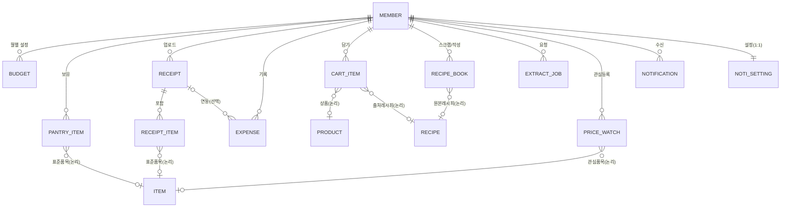
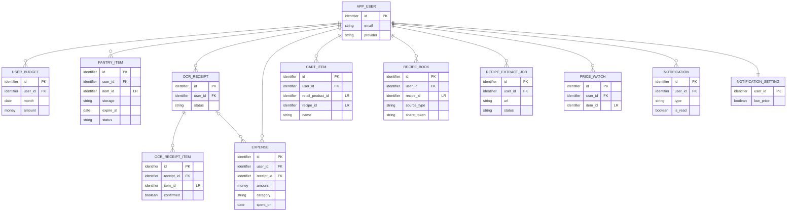

# 앱 OLTP 데이터 명세서 — 개념 · 논리 · 물리 (초안)

> **상태: 제안 초안 (2026-07-15).** 확정 아님. 담당자 검토·확정 전 참고용 밑그림.
>
> **근거:** [`docs/prd/schema-app-oltp.md`](./schema-app-oltp.md)(테이블 제안) + [`docs/design/api-spec.md`](../design/api-spec.md)(엔드포인트) + `frontend/` 화면 요구 필드.
>
> **범위:** 유저가 **생성(write)** 하는 데이터만. 크롤·공공데이터(읽기)는 데이터 티어 [`schema-public-data.sql`](./schema-public-data.sql)에 있고, 여기선 **논리참조**로만 연결.
>
> 이 문서는 같은 대상을 **3단계 상세도**로 전개한다: 개념(무엇을·어떻게 관계) → 논리(속성·키·정규화) → 물리(PostgreSQL DDL).

---

## 0. 3단계 개요

| 단계 | 답하는 질문 | 표현 | 독립성 |
|---|---|---|---|
| **개념적** | 어떤 **업무 엔터티**가 있고 서로 **어떻게 관계**되나 | 엔터티·관계 ERD (속성 없음) | 기술 무관 |
| **논리적** | 각 엔터티의 **속성·식별자·정규화** | 속성 정의표 + 키 표시 ERD | DBMS 무관 |
| **물리적** | 실제 **테이블·타입·제약·인덱스** | PostgreSQL DDL | PostgreSQL 종속 |

**대상 엔터티 12개** (도메인 6):
계정·예산(회원, 월예산) · 냉장고(재고, 영수증, 영수증항목) · 식비(지출) · 장보기(장바구니항목) · 레시피(레시피북, 추출작업) · 관심·알림(관심시세, 알림, 알림설정).

**데이터 티어 참조 대상 (외부·읽기):** `item_master`(표준품목) · `recipe`(레시피) · `retail_product`(상품). → §3.4 논리참조.

---

## 1. 개념적 데이터 모델 (Conceptual)

### 1.1 엔터티 목록

| # | 개념 엔터티 | 설명 | 성격 |
|---|---|---|---|
| E1 | **회원** | 앱 계정(자체/카카오). 모든 유저 데이터의 소유 주체 | 기준 |
| E2 | **월예산** | 회원의 월별 식비 예산액 | 이력(월) |
| E3 | **냉장고재고** | 회원이 보유한 식재료(실온/냉장/냉동) | 상태 |
| E4 | **영수증** | 회원이 올린 영수증 OCR 작업(비동기) | 이벤트 |
| E5 | **영수증항목** | 영수증에서 파싱된 개별 품목(확정 전) | 명세 |
| E6 | **지출** | 회원의 식비 지출 기록(장보기/외식/배달) | 이벤트 |
| E7 | **장바구니항목** | 회원이 담은 구매 예정 재료 | 상태 |
| E8 | **레시피북** | 회원이 스크랩/추출/작성한 레시피 | 상태 |
| E9 | **추출작업** | YouTube URL → 레시피 추출 작업(비동기) | 이벤트 |
| E10 | **관심시세** | 회원이 최저가 알림을 건 품목 | 상태 |
| E11 | **알림** | 회원에게 발송된 알림(최저가/임박/핫딜/예산) | 이벤트 |
| E12 | **알림설정** | 회원별 알림 수신 on/off | 설정(1:1) |
| X1 | *표준품목* | (데이터 티어) `item_master` — 품목·영양 기준 | 외부 |
| X2 | *레시피* | (데이터 티어) `recipe` — 레시피 본문 | 외부 |
| X3 | *상품* | (데이터 티어) `retail_product` — 판매 상품·현재가 | 외부 |

### 1.2 개념 ERD



> `ITEM`·`PRODUCT`·`RECIPE`(점선 개념)는 **데이터 티어(외부·읽기)** 엔터티. OLTP DB 분리 시 물리 FK 없이 `bigint` 논리참조(§3.4).

### 1.3 관계·카디널리티 요약

| 관계 | 카디널리티 | 비고 |
|---|---|---|
| 회원 — 월예산 | 1 : N | 월(`month`)당 1행, `(회원, 월)` 유일 |
| 회원 — 냉장고재고 | 1 : N | |
| 회원 — 영수증 — 영수증항목 | 1 : N : N | 영수증 삭제 시 항목 연쇄삭제 |
| 회원 — 지출 | 1 : N | 지출 — 영수증 = N : 1 (선택) |
| 회원 — 장바구니항목 | 1 : N | 유저당 단일 active 장바구니(결정필요 #4) |
| 회원 — 레시피북 | 1 : N | 회원 M:N 레시피의 **해소 엔터티** |
| 회원 — 추출작업 | 1 : N | |
| 회원 — 관심시세 | 1 : N | 회원 M:N 품목의 **해소 엔터티**, `(회원, 품목)` 유일 |
| 회원 — 알림 | 1 : N | |
| 회원 — 알림설정 | 1 : 1 | 회원 PK = 설정 PK |

**M:N → 해소:** ①회원↔레시피(스크랩) = `레시피북`, ②회원↔품목(관심) = `관심시세`. 둘 다 교차 엔터티로 이미 1:N 두 개로 분해됨.

---

## 2. 논리적 데이터 모델 (Logical)

### 2.1 정규화 방침

- **3NF 기준.** 이행종속 제거(예: 프론트 파생값 `dday`·`emoji`·포맷 문자열·퍼센트는 **비저장** — 원시값만 두고 표시는 클라이언트 계산).
- **자연키 대신 대리키**(`id`) 사용 — 데이터 티어 컨벤션과 일치, 조인 단순.
- 논리 데이터 타입: `식별자` / `문자` / `정수` / `금액(소수)` / `논리` / `일자` / `일시` / `문서(JSON)` — DBMS 독립 표기(물리 매핑은 §3).

### 2.2 엔터티 속성 정의

키: **PK**=기본키, **FK**=외래키, **LR**=논리참조(데이터 티어, FK 미설정), **U**=유일제약.

#### E1. 회원 (app_user)
| 속성 | 논리타입 | 키 | Null | 설명 |
|---|---|---|---|---|
| id | 식별자 | PK | N | |
| email | 문자 | U | Y | 카카오 전용이면 null |
| password_hash | 문자 | | Y | 자체 로그인만 |
| nickname | 문자 | | N | |
| provider | 문자 | | N | `local` \| `kakao` |
| provider_uid | 문자 | | Y | 카카오 회원번호. `(provider, provider_uid)` 유일 |
| created_at / updated_at | 일시 | | N | |

#### E2. 월예산 (user_budget)
| 속성 | 논리타입 | 키 | Null | 설명 |
|---|---|---|---|---|
| id | 식별자 | PK | N | |
| user_id | 식별자 | FK→회원 | N | |
| month | 일자 | U | N | 매월 1일 정규화. `(user_id, month)` 유일 |
| amount | 금액 | | N | 월 예산액(KRW) |
| created_at | 일시 | | N | |

#### E3. 냉장고재고 (pantry_item)
| 속성 | 논리타입 | 키 | Null | 설명 |
|---|---|---|---|---|
| id | 식별자 | PK | N | |
| user_id | 식별자 | FK→회원 | N | |
| item_id | 식별자 | LR→표준품목 | Y | 표준품목 매핑(영양·emoji) |
| name | 문자 | | N | 표시명(원문/수기) |
| quantity | 문자 | | Y | `1단`,`500g`,`8구` 원문 |
| storage | 문자 | | N | `ROOM`\|`FRIDGE`\|`FREEZER` |
| expire_at | 일자 | | Y | 소비기한(추정/입력). dday는 프론트 계산 |
| source | 문자 | | N | `MANUAL`\|`OCR` |
| status | 문자 | | N | `ACTIVE`\|`CONSUMED`\|`DISCARDED` |
| created_at | 일시 | | N | |
| closed_at | 일시 | | Y | 소진/폐기 시각 → 성과지표 |

#### E4. 영수증 (ocr_receipt)
| 속성 | 논리타입 | 키 | Null | 설명 |
|---|---|---|---|---|
| id | 식별자 | PK | N | |
| user_id | 식별자 | FK→회원 | N | |
| status | 문자 | | N | `PENDING`\|`DONE`\|`FAILED` |
| store | 문자 | | Y | 인식 매장명 |
| purchased_at | 일시 | | Y | |
| total_amount | 금액 | | Y | |
| created_at | 일시 | | N | 원본 이미지 URL 비저장(분석에만) |

#### E5. 영수증항목 (ocr_receipt_item)
| 속성 | 논리타입 | 키 | Null | 설명 |
|---|---|---|---|---|
| id | 식별자 | PK | N | |
| receipt_id | 식별자 | FK→영수증 | N | 연쇄삭제 |
| raw_text | 문자 | | Y | `삼겹500` 원문 |
| name | 문자 | | Y | 매칭 표시명 |
| item_id | 식별자 | LR→표준품목 | Y | NER 결과 |
| quantity | 문자 | | Y | |
| price | 금액 | | Y | |
| is_food | 논리 | | N | 비재료(봉투 등) 제외 |
| confirmed | 논리 | | N | 유저 확정 여부 |

#### E6. 지출 (expense)
| 속성 | 논리타입 | 키 | Null | 설명 |
|---|---|---|---|---|
| id | 식별자 | PK | N | |
| user_id | 식별자 | FK→회원 | N | |
| amount | 금액 | | N | |
| category | 문자 | | N | `GROCERY`\|`DINING`\|`DELIVERY`\|`ETC` |
| spent_on | 일자 | | N | 캘린더 집계 키 |
| memo | 문자 | | Y | |
| source | 문자 | | N | `MANUAL`\|`OCR`\|`CART` |
| receipt_id | 식별자 | FK→영수증 | Y | 삭제 시 null |
| created_at | 일시 | | N | |

#### E7. 장바구니항목 (cart_item)
| 속성 | 논리타입 | 키 | Null | 설명 |
|---|---|---|---|---|
| id | 식별자 | PK | N | |
| user_id | 식별자 | FK→회원 | N | |
| retail_product_id | 식별자 | LR→상품 | Y | 현재가·매장(실시간 조회) |
| recipe_id | 식별자 | LR→레시피 | Y | 담긴 출처 레시피 |
| item_id | 식별자 | LR→표준품목 | Y | |
| name | 문자 | | N | 스냅샷 표시명 |
| quantity | 문자 | | Y | |
| added_at | 일시 | | N | 가격은 비저장, 실시간 조회(결정필요 #6) |

#### E8. 레시피북 (recipe_book)
| 속성 | 논리타입 | 키 | Null | 설명 |
|---|---|---|---|---|
| id | 식별자 | PK | N | |
| user_id | 식별자 | FK→회원 | N | |
| recipe_id | 식별자 | LR→레시피 | Y | `SAVED`일 때만 |
| source_type | 문자 | | N | `SAVED`\|`EXTRACTED`\|`CUSTOM` |
| title | 문자 | | N | |
| is_public | 논리 | | N | |
| share_token | 문자 | U | Y | 공유 URL 토큰 |
| created_at | 일시 | | N | |

#### E9. 추출작업 (recipe_extract_job)
| 속성 | 논리타입 | 키 | Null | 설명 |
|---|---|---|---|---|
| id | 식별자 | PK | N | |
| user_id | 식별자 | FK→회원 | N | |
| url | 문자 | | N | YouTube URL |
| status | 문자 | | N | `PENDING`\|`DONE`\|`FAILED` |
| result | 문서(JSON) | | Y | 추출 재료·단계 미리보기 |
| created_at | 일시 | | N | |

#### E10. 관심시세 (price_watch)
| 속성 | 논리타입 | 키 | Null | 설명 |
|---|---|---|---|---|
| id | 식별자 | PK | N | |
| user_id | 식별자 | FK→회원 | N | |
| item_id | 식별자 | LR→표준품목 | Y | `(user_id, item_id)` 유일(FK 승격 시) |
| created_at | 일시 | | N | |

#### E11. 알림 (notification)
| 속성 | 논리타입 | 키 | Null | 설명 |
|---|---|---|---|---|
| id | 식별자 | PK | N | |
| user_id | 식별자 | FK→회원 | N | |
| type | 문자 | | N | `LOW_PRICE`\|`EXPIRING`\|`HOTDEAL`\|`BUDGET` |
| title | 문자 | | N | |
| body | 문자 | | Y | |
| payload | 문서(JSON) | | Y | 딥링크 데이터(`{item_id,recipe_id,…}`) |
| is_read | 논리 | | N | |
| created_at | 일시 | | N | |

#### E12. 알림설정 (notification_setting)
| 속성 | 논리타입 | 키 | Null | 설명 |
|---|---|---|---|---|
| user_id | 식별자 | PK, FK→회원 | N | 1:1 (회원 PK = 설정 PK) |
| low_price / expiry / hotdeal / budget | 논리 | | N | 채널별 on/off, 기본 true |
| updated_at | 일시 | | N | |

### 2.3 논리 ERD (키 표시)



---

## 3. 물리적 데이터 모델 (Physical · PostgreSQL)

### 3.1 물리 컨벤션 (데이터 티어와 동일)

| 논리타입 | PostgreSQL | 비고 |
|---|---|---|
| 식별자(PK) | `bigserial` | |
| 식별자(FK/LR) | `bigint` | |
| 문자 | `text` | 길이 제한 대신 `CHECK` |
| 금액 | `numeric` | KRW, `retail_price.price`와 일관 |
| 논리 | `boolean` | |
| 일자 | `date` | |
| 일시 | `timestamptz` | 기본 `now()` |
| 문서 | `jsonb` | |
| enum | `text CHECK (col IN (...))` | 별도 타입 미사용(기존 방식) |

### 3.2 DDL

```sql
-- ═══════════ 계정 · 예산 ═══════════
CREATE TABLE app_user (
  id            bigserial PRIMARY KEY,
  email         text UNIQUE,
  password_hash text,
  nickname      text NOT NULL,
  provider      text NOT NULL DEFAULT 'local' CHECK (provider IN ('local','kakao')),
  provider_uid  text,
  created_at    timestamptz NOT NULL DEFAULT now(),
  updated_at    timestamptz NOT NULL DEFAULT now(),
  UNIQUE (provider, provider_uid)
);

CREATE TABLE user_budget (
  id         bigserial PRIMARY KEY,
  user_id    bigint NOT NULL REFERENCES app_user(id) ON DELETE CASCADE,
  month      date NOT NULL,               -- 매월 1일 정규화
  amount     numeric NOT NULL CHECK (amount >= 0),
  created_at timestamptz NOT NULL DEFAULT now(),
  UNIQUE (user_id, month)
);

-- ═══════════ 냉장고 (Pantry) ═══════════
CREATE TABLE pantry_item (
  id         bigserial PRIMARY KEY,
  user_id    bigint NOT NULL REFERENCES app_user(id) ON DELETE CASCADE,
  item_id    bigint,   -- ▶ LR item_master(item_id)  (같은 DB 확정 시 FK 승격)
  name       text NOT NULL,
  quantity   text,
  storage    text NOT NULL CHECK (storage IN ('ROOM','FRIDGE','FREEZER')),
  expire_at  date,
  source     text NOT NULL DEFAULT 'MANUAL' CHECK (source IN ('MANUAL','OCR')),
  status     text NOT NULL DEFAULT 'ACTIVE' CHECK (status IN ('ACTIVE','CONSUMED','DISCARDED')),
  created_at timestamptz NOT NULL DEFAULT now(),
  closed_at  timestamptz
);
CREATE INDEX idx_pantry_user_status ON pantry_item (user_id, status);
CREATE INDEX idx_pantry_user_expire ON pantry_item (user_id, expire_at);

CREATE TABLE ocr_receipt (
  id           bigserial PRIMARY KEY,
  user_id      bigint NOT NULL REFERENCES app_user(id) ON DELETE CASCADE,
  status       text NOT NULL DEFAULT 'PENDING' CHECK (status IN ('PENDING','DONE','FAILED')),
  store        text,
  purchased_at timestamptz,
  total_amount numeric,
  created_at   timestamptz NOT NULL DEFAULT now()
);
CREATE INDEX idx_receipt_user ON ocr_receipt (user_id, created_at DESC);

CREATE TABLE ocr_receipt_item (
  id         bigserial PRIMARY KEY,
  receipt_id bigint NOT NULL REFERENCES ocr_receipt(id) ON DELETE CASCADE,
  raw_text   text,
  name       text,
  item_id    bigint,   -- ▶ LR item_master(item_id)
  quantity   text,
  price      numeric,
  is_food    boolean NOT NULL DEFAULT true,
  confirmed  boolean NOT NULL DEFAULT false
);
CREATE INDEX idx_receipt_item_receipt ON ocr_receipt_item (receipt_id);

-- ═══════════ 식비 (Expense) ═══════════
CREATE TABLE expense (
  id         bigserial PRIMARY KEY,
  user_id    bigint NOT NULL REFERENCES app_user(id) ON DELETE CASCADE,
  amount     numeric NOT NULL CHECK (amount >= 0),
  category   text NOT NULL CHECK (category IN ('GROCERY','DINING','DELIVERY','ETC')),
  spent_on   date NOT NULL,
  memo       text,
  source     text NOT NULL DEFAULT 'MANUAL' CHECK (source IN ('MANUAL','OCR','CART')),
  receipt_id bigint REFERENCES ocr_receipt(id) ON DELETE SET NULL,
  created_at timestamptz NOT NULL DEFAULT now()
);
CREATE INDEX idx_expense_user_date ON expense (user_id, spent_on);

-- ═══════════ 장보기 (Cart) ═══════════
CREATE TABLE cart_item (
  id                bigserial PRIMARY KEY,
  user_id           bigint NOT NULL REFERENCES app_user(id) ON DELETE CASCADE,
  retail_product_id bigint,   -- ▶ LR retail_product(id)
  recipe_id         bigint,   -- ▶ LR recipe(id)
  item_id           bigint,   -- ▶ LR item_master(item_id)
  name              text NOT NULL,
  quantity          text,
  added_at          timestamptz NOT NULL DEFAULT now()
);
CREATE INDEX idx_cart_user ON cart_item (user_id);

-- ═══════════ 레시피북 · 추출 · 관심 · 알림 ═══════════
CREATE TABLE recipe_book (
  id          bigserial PRIMARY KEY,
  user_id     bigint NOT NULL REFERENCES app_user(id) ON DELETE CASCADE,
  recipe_id   bigint,   -- ▶ LR recipe(id)  (source_type='SAVED'일 때)
  source_type text NOT NULL CHECK (source_type IN ('SAVED','EXTRACTED','CUSTOM')),
  title       text NOT NULL,
  is_public   boolean NOT NULL DEFAULT false,
  share_token text UNIQUE,
  created_at  timestamptz NOT NULL DEFAULT now()
);
CREATE INDEX idx_recipebook_user ON recipe_book (user_id);

CREATE TABLE recipe_extract_job (
  id         bigserial PRIMARY KEY,
  user_id    bigint NOT NULL REFERENCES app_user(id) ON DELETE CASCADE,
  url        text NOT NULL,
  status     text NOT NULL DEFAULT 'PENDING' CHECK (status IN ('PENDING','DONE','FAILED')),
  result     jsonb,
  created_at timestamptz NOT NULL DEFAULT now()
);
CREATE INDEX idx_extractjob_user ON recipe_extract_job (user_id, created_at DESC);

CREATE TABLE price_watch (
  id         bigserial PRIMARY KEY,
  user_id    bigint NOT NULL REFERENCES app_user(id) ON DELETE CASCADE,
  item_id    bigint,   -- ▶ LR item_master(item_id)
  created_at timestamptz NOT NULL DEFAULT now()
  -- , UNIQUE (user_id, item_id)   -- item_id FK 승격 시 활성화
);
CREATE INDEX idx_pricewatch_user ON price_watch (user_id);

CREATE TABLE notification (
  id         bigserial PRIMARY KEY,
  user_id    bigint NOT NULL REFERENCES app_user(id) ON DELETE CASCADE,
  type       text NOT NULL CHECK (type IN ('LOW_PRICE','EXPIRING','HOTDEAL','BUDGET')),
  title      text NOT NULL,
  body       text,
  payload    jsonb,
  is_read    boolean NOT NULL DEFAULT false,
  created_at timestamptz NOT NULL DEFAULT now()
);
CREATE INDEX idx_noti_user_unread ON notification (user_id, is_read, created_at DESC);

CREATE TABLE notification_setting (
  user_id    bigint PRIMARY KEY REFERENCES app_user(id) ON DELETE CASCADE,
  low_price  boolean NOT NULL DEFAULT true,
  expiry     boolean NOT NULL DEFAULT true,
  hotdeal    boolean NOT NULL DEFAULT true,
  budget     boolean NOT NULL DEFAULT true,
  updated_at timestamptz NOT NULL DEFAULT now()
);
```

### 3.3 인덱스·제약 요약

| 테이블 | PK | 유일(U) | 인덱스 | 연쇄 |
|---|---|---|---|---|
| app_user | id | email, (provider,provider_uid) | | |
| user_budget | id | (user_id, month) | | FK CASCADE |
| pantry_item | id | | (user,status),(user,expire) | FK CASCADE |
| ocr_receipt | id | | (user,created_at↓) | FK CASCADE |
| ocr_receipt_item | id | | (receipt) | FK CASCADE |
| expense | id | | (user,spent_on) | receipt SET NULL |
| cart_item | id | | (user) | FK CASCADE |
| recipe_book | id | share_token | (user) | FK CASCADE |
| recipe_extract_job | id | | (user,created_at↓) | FK CASCADE |
| price_watch | id | (user,item)† | (user) | FK CASCADE |
| notification | id | | (user,is_read,created_at↓) | FK CASCADE |
| notification_setting | user_id | | | FK CASCADE |

† `item_id` FK 승격 시 활성화.

### 3.4 데이터 티어 논리참조(LR) → FK 승격 가이드

OLTP를 데이터 티어와 **같은 DB(스키마만 분리)** 로 확정하면, 아래 `bigint` 논리참조를 진짜 FK로 승격:

| OLTP 컬럼 | 대상 (실 PK) | 승격 DDL |
|---|---|---|
| `pantry_item.item_id` · `ocr_receipt_item.item_id` · `cart_item.item_id` · `price_watch.item_id` | `item_master(item_id)` | `... REFERENCES item_master(item_id)` |
| `cart_item.retail_product_id` | `retail_product(id)` | `... REFERENCES retail_product(id)` |
| `cart_item.recipe_id` · `recipe_book.recipe_id` | `recipe(id)` | `... REFERENCES recipe(id)` |

> **다른 DB/인스턴스면** cross-DB FK 불가 → 논리참조 유지 + 애플리케이션 레벨 정합성 보증. (결정필요 #1)

---

## 4. api-spec 커버리지

| api-spec # | 엔드포인트 | 물리 테이블 |
|---|---|---|
| 2~6 | `/api/auth/*` | `app_user` |
| 7~8 | `/api/users/me` | `app_user` |
| 9~10 | `/api/users/budget` | `user_budget` |
| 11~15 | `/api/pantry/items`·`/expiring` | `pantry_item` |
| 16~17 | `/api/pantry/ocr` | `ocr_receipt`·`ocr_receipt_item` |
| 20~23 | `/api/recipes/book` | `recipe_book` |
| 24~25 | `/api/recipes/extract` | `recipe_extract_job` |
| 29~30 | `/api/prices/watch` | `price_watch` |
| 33~36 | `/api/mealplan/cart` | `cart_item` (+ checkout 시 `expense`) |
| 38~40 | `/api/expenses/*` | `expense` |
| 41~42 | `/api/notifications` | `notification` |
| 43~44 | `/api/notifications/settings` | `notification_setting` |

**테이블 불필요(읽기/stateless):** #18~19 레시피, #26~28·31 시세·핫딜, #32 추천, #37 어시스턴트(RAG), #45~47 ML.

---

## 5. 3단계 추적성 매트릭스

| 개념(§1) | 논리(§2) | 물리(§3) | 상태 이력 |
|---|---|---|---|
| 회원 | app_user | `app_user` | 기준 |
| 월예산 | user_budget | `user_budget` | 월 이력 |
| 냉장고재고 | pantry_item | `pantry_item` | status 전이 |
| 영수증 / 영수증항목 | ocr_receipt / ocr_receipt_item | `ocr_receipt` / `ocr_receipt_item` | 비동기 job |
| 지출 | expense | `expense` | 이벤트 |
| 장바구니항목 | cart_item | `cart_item` | active/checkout |
| 레시피북 | recipe_book | `recipe_book` | 스크랩(M:N 해소) |
| 추출작업 | recipe_extract_job | `recipe_extract_job` | 비동기 job |
| 관심시세 | price_watch | `price_watch` | 관심(M:N 해소) |
| 알림 | notification | `notification` | 이벤트 |
| 알림설정 | notification_setting | `notification_setting` | 1:1 설정 |

---

## 6. 결정 필요 (담당자 확정) — `schema-app-oltp.md §6`과 동일

1. **OLTP DB 분리 여부** → 진짜 FK vs 논리참조(초안 기본값). §3.4.
2. **유저 레시피 저장 위치** — `recipe`에 `source='USER'` 확장 vs 별도 `user_recipe`. (레시피북 `source_type`만 우선)
3. **OCR 파싱 결과 형태** — 정규화 `ocr_receipt_item`(초안) vs `ocr_receipt.result jsonb` 단일.
4. **장바구니 범위** — 유저당 단일 active cart(초안) vs 헤더 + 주문이력(`shopping_order`).
5. **알림 설정 위치** — 별도 `notification_setting`(초안) vs `app_user` 인라인.
6. **가격 스냅샷** — `cart_item` 담을 때 고정 vs 실시간 조회(초안).
7. **`meal_plan` 영속화** — `POST /mealplan/recommend` stateless면 불필요(초안엔 없음).

---

## 7. 다음 단계

1. §6 확정 → 논리·물리 반영
2. 물리 DDL을 `schema-app-oltp.sql`로 구현 + `apply_schema.py` 계열 멱등 적용
3. `api-spec.md` 해당 엔드포인트 **응답 스키마 상세화**(이 테이블 기준)
4. 프론트 → 실 응답 shape 연동 (레시피·핫딜 연동 방식과 동일: `/api/*` + 프록시)
